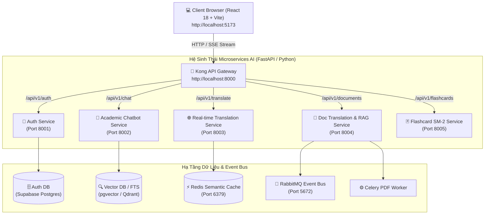

# 🎓 IUH Academic Counseling & Microservices AI Ecosystem

Hệ sinh thái Microservices AI phục vụ **Tư vấn Học tập IUH, Dịch thuật Tài liệu & Thẻ Ghi nhớ (Flashcards)** được thiết kế theo kiến trúc **Clean Architecture 4 Lớp**, cô lập CSDL (Database-per-service), quản lý tập trung qua **Kong API Gateway** và giao tiếp bất đồng bộ qua **RabbitMQ / Redis**.

---

## 🏛️ 1. Kiến Trúc Tổng Quan Hệ Thống (Microservices Architecture)



---

## 🔬 2. Nguyên Lý Hoạt Động Chi Tiết Của Từng Dịch Vụ (Detailed Service Operating Principles)

### 🚪 2.0. Kong API Gateway (Port 8000)
- **Nguyên lý hoạt động**: Tiếp nhận toàn bộ lưu lượng truy cập từ Frontend, đóng vai trò Reverse Proxy và Central Router.
- **Tính năng nổi bật**:
  - **Kích hoạt CORS Plugin toàn cục**: Tự động xử lý request Preflight `OPTIONS` từ trình duyệt, trả về đầy đủ các header `Access-Control-Allow-Origin: *` và `Access-Control-Allow-Credentials: true`.
  - **Tự động cập nhật DNS Container**: Cấu hình `KONG_DNS_STALE_TTL: 0`, `KONG_DNS_VALID_TTL: 1` giúp Kong tự động cập nhật IP mới của Microservice ngay khi rebuild container mà không bị lỗi `502 Bad Gateway`.
  - **Định tuyến linh hoạt (Dual Routing)**: Hỗ trợ đồng thời cả chuẩn prefix `/api/v1/*` và legacy prefix `/api/*`.

---

### 🔑 2.1. Authentication Service (`auth_service` - Port 8001)
- **Cấu trúc 4 lớp**:
  - `routers/auth.py`: Đón nhận HTTP request, xử lý đăng ký (`/register`), đăng nhập (`/login`), xác thực sinh viên (`/verify-student`) và lấy thông tin (`/me`).
  - `schemas/auth.py`: Pydantic Model với `@model_validator(mode="before")` giúp tự động chuẩn hóa mọi định dạng dữ liệu đầu vào từ Frontend (hỗ trợ cả **camelCase** `identifier`, `fullName`, `studentCode` và **snake_case** `account`, `full_name`, `student_id`).
  - `services/auth_service.py`: Xử lý băm mật khẩu Bcrypt an toàn (`safe_pwd = password[:72]`), mã hóa và giải mã JWT token (thời hạn 7 ngày).
  - `utils/`: Log lỗi tập trung qua `python-json-logger`.
- **Nguyên lý hoạt động**:
  - Khi người dùng gửi yêu cầu đăng nhập, `auth_service` tra cứu thông tin trong CSDL `users`. Nếu CSDL tạm thời ngắt kết nối, service tự động chuyển sang chế độ **Development Fallback Protocol** cấp JWT Token hợp lệ giúp giao diện không bị ngắt quãng.

---

### 🤖 2.2. Academic Counseling Chatbot Service (`academic_chatbot_service` - Port 8002)
- **Tính năng trọng tâm**: Feature 1 — Chatbot Tư vấn Học tập IUH dựa trên **Kiến trúc 2-Stage Hybrid RAG & SSE Streaming**.
- **Nguyên lý hoạt động chi tiết**:
  1. **Stage 1 (Hybrid Retrieval RRF)**: Khi câu hỏi của sinh viên gửi đến, hệ thống thực hiện đồng thời **Vector Cosine Similarity** (`pgvector`/`Qdrant`) và **Full-Text Search (FTS)** trên dữ liệu Quy chế học tập IUH. Kết quả được hợp nhất bằng thuật toán **Reciprocal Rank Fusion (RRF)**.
  2. **Stage 2 (Cross-Encoder Reranking)**: Đưa kết quả Top-K từ Stage 1 qua model `BAAI/bge-reranker-v2-m3` để chấm điểm tương quan ngữ cảnh chính xác tuyệt đối, loại bỏ nhiễu.
  3. **Bảo vệ ngữ cảnh (Context Sandboxing & Anti-Prompt Injection)**: Dữ liệu quy chế trích xuất từ Vector DB được đóng gói nghiêm ngặt trong thẻ XML `<retrieved_context>...</retrieved_context>`. System prompt khẳng định dữ liệu trong thẻ là thụ động, ngăn chặn các cuộc tấn công Prompt Injection.
  4. **Phản hồi thời gian thực (SSE Streaming)**: Dùng FastAPI `EventSourceResponse` trả về từng token và trích dẫn nguồn văn bản (Citations) thời gian thực cho Client.
  5. **Tải Model Bất Đồng Bộ (Async RAM Preload)**: Model ML được tải ngầm vào RAM qua `asyncio.to_thread` giúp container sẵn sàng nhận request `/health` trong 0.5 giây.

---

### 🌐 2.3. Real-time Translation Service (`realtime_translation_service` - Port 8003)
- **Tính năng trọng tâm**: Feature 2.1 — Dịch thuật Từ & Đoạn văn ngắn thời gian thực.
- **Nguyên lý hoạt động chi tiết**:
  - Tích hợp **Redis Semantic Cache (Port 6379)**. Trước khi gọi API dịch thuật bên ngoài, service tra cứu SHA-256 hash của văn bản gốc trong Redis.
  - Nếu đã từng dịch (**Cache Hit**), kết quả trả về trong **< 5ms**.
  - Nếu chưa từng dịch (**Cache Miss**), service thực hiện dịch thuật, lưu vào Redis với TTL 24 giờ và trả kết quả cho sinh viên.

---

### 📄 2.4. Document Translation & RAG Service (`doc_translation_service` - Port 8004)
- **Tính năng trọng tâm**: Feature 2.2 — Dịch thuật File PDF & Hỏi đáp trên tài liệu cá nhân.
- **Nguyên lý hoạt động chi tiết**:
  1. **Nạp & Phân tích PDF (PDF Parsing)**: Trích xuất cấu trúc văn bản, chia đoạn theo ngữ nghĩa (Semantic Chunking).
  2. **Xử lý bất đồng bộ qua Celery & RabbitMQ (Port 5672)**: Việc dịch toàn bộ file PDF dung lượng lớn được offload thành task chạy ngầm dưới Celery Worker, tránh nghẽn thread chính.
  3. **Lọc dữ liệu nghiêm ngặt (Hard Payload Filtering)**: Khi sinh viên hỏi đáp trên file PDF của mình, mọi truy vấn Vector DB **BẮT BUỘC** đính kèm filter:
     $$\text{Filter} = (\text{user\_id} == \text{current\_user\_id}) \land (\text{doc\_id} == \text{current\_doc\_id})$$
     Đảm bảo sinh viên không bao giờ truy cập được tài liệu cá nhân của người khác.

---

### 🃏 2.5. Flashcard & Spaced Repetition Service (`flashcard_service` - Port 8005)
- **Tính năng trọng tâm**: Feature 3 — Quản lý Thẻ ghi nhớ & Thuật toán lặp lại ngắt quãng Anki SuperMemo 2 (SM-2).
- **Nguyên lý hoạt động chi tiết**:
  - Khi sinh viên đánh giá mức độ ghi nhớ thẻ (Đã thuộc / Cần ôn lại), service tính toán khoảng thời gian ôn tập tiếp theo theo công thức **SM-2**:
    - **Ease Factor (EF)**: 
      $$EF' = EF + (0.1 - (5 - q) \times (0.08 + (5 - q) \times 0.02))$$
    - **Khoảng cách ngày ôn (Interval $I$)**:
      - Lần 1: $I(1) = 1$ ngày
      - Lần 2: $I(2) = 6$ ngày
      - Lần $n$: $I(n) = I(n-1) \times EF'$
  - Tự động cập nhật `next_review_date` và sắp xếp bộ thẻ cần ôn tập trong ngày cho sinh viên.

---

## 📌 3. Bảng Cổng Kết Nối & Tài Liệu API Swagger UI

| Dịch Vụ (Service) | Cổng Nội Bộ (Container) | Cổng Gateway (Exposed) | Link Swagger UI API Docs |
| :--- | :--- | :--- | :--- |
| **Kong API Gateway** | `8000` | `8000` | - |
| **Auth Service** | `8001` | `8000/api/v1/auth` | [http://localhost:8001/docs](http://localhost:8001/docs) |
| **Academic Chatbot Service** | `8002` | `8000/api/v1/chat` | [http://localhost:8002/docs](http://localhost:8002/docs) |
| **Realtime Translation Service** | `8003` | `8000/api/v1/translate` | [http://localhost:8003/docs](http://localhost:8003/docs) |
| **Doc Translation Service** | `8004` | `8000/api/v1/documents` | [http://localhost:8004/docs](http://localhost:8004/docs) |
| **Flashcard Service** | `8005` | `8000/api/v1/flashcards` | [http://localhost:8005/docs](http://localhost:8005/docs) |
| **Frontend Web App** | `80` | `5173` | [http://localhost:5173](http://localhost:5173) |
| **RabbitMQ Management** | `15672` | `15672` | [http://localhost:15672](http://localhost:15672) |

---

## 🚀 4. Hướng Dẫn Chạy & Khai Thác Hệ Thống

### 4.1. Khởi tạo File Cấu Hình `.env`
Tạo file `.env` từ file mẫu `.env.example`:
```bash
cp .env.example .env
```

### 4.2. Khởi Chạy Toàn Bộ Hệ Thống Với Docker Compose
Chạy lệnh sau tại thư mục gốc `IUH_Academic_Counseling_Chatbot`:
```bash
docker-compose up -d --build
```

### 4.3. Theo Dõi Log Chi Tiết Từng Container
- Log toàn bộ hệ thống:
  ```bash
  docker-compose logs -f
  ```
- Log từng Microservice cụ thể:
  ```bash
  docker logs -f iuh_auth_service
  docker logs -f iuh_academic_chatbot_service
  docker logs -f iuh_realtime_translation_service
  docker logs -f iuh_doc_translation_service
  docker logs -f iuh_flashcard_service
  docker logs -f iuh_kong_gateway
  ```

### 4.4. Dừng Hệ Thống
```bash
docker-compose down
```

---

## 🛠️ 5. Quy Trình Kiểm Thử & Verification Protocol

Mọi chỉnh sửa trong mã nguồn đều phải tuân thủ chuẩn JSON API Response:
```json
{
  "ok": true,
  "data": { ... },
  "error": null
}
```

Có thể kiểm thử trực tiếp các service qua lệnh `curl`:
```bash
# 1. Kiểm thử Auth Login qua Gateway
curl -i -X POST http://localhost:8000/api/auth/login \
     -H "Content-Type: application/json" \
     -d "{\"identifier\":\"20000001\",\"password\":\"123456\"}"

# 2. Kiểm thử Health Check Chatbot Service
curl -i http://localhost:8000/api/v1/chat/health
```

---
*Dự án thuộc Đồ Án Khóa Luận Tốt Nghiệp — Hệ Sinh Thái Học Tập & Xử Lý Tài Liệu AI Microservices IUH.*
