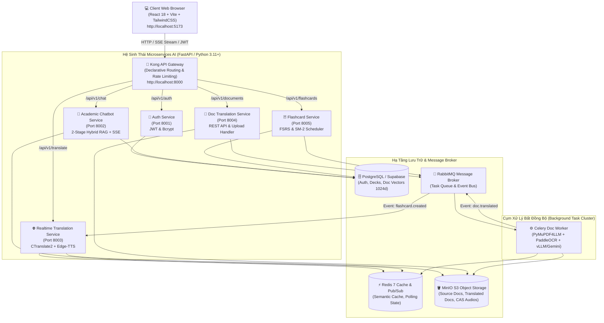
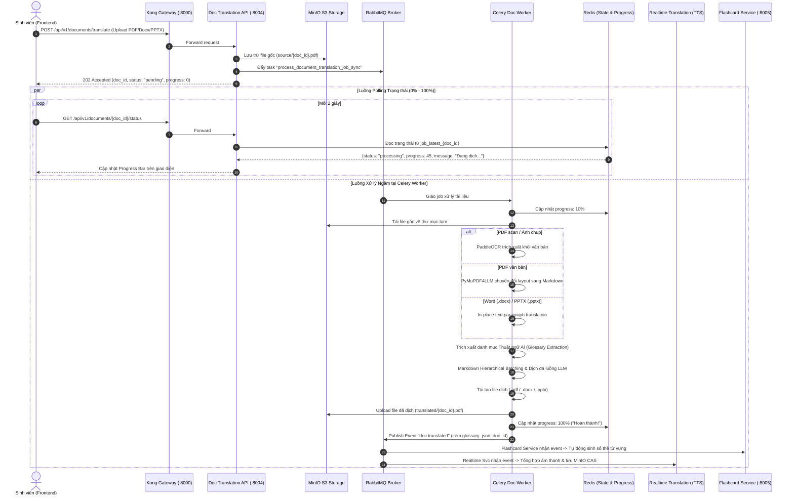
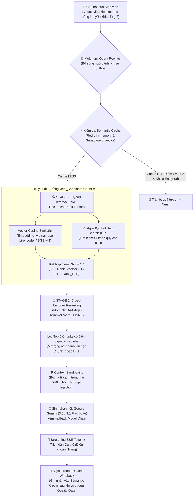

# 🎓 IUH Academic Counseling & Microservices AI Ecosystem

[](https://www.python.org/)
[](https://fastapi.tiangolo.com/)
[](https://react.dev/)
[](https://www.typescriptlang.org/)
[](https://vitejs.dev/)
[](https://tailwindcss.com/)
[](https://github.com/pgvector/pgvector)
[](https://konghq.com/)
[](https://www.rabbitmq.com/)
[](https://redis.io/)
[](https://min.io/)
[](https://www.docker.com/)

> **Đề tài Khóa luận Tốt nghiệp**: Hệ sinh thái Microservices AI phục vụ **Tư vấn Quy chế Học vụ IUH**, **Dịch thuật Tài liệu Chuyên ngành Đa định dạng (OCR/Layout Preservation)** và **Học từ vựng Spaced Repetition (FSRS/SM-2)** dành cho sinh viên Trường Đại học Công nghiệp TP. Hồ Chí Minh (IUH).

---

## 📑 Mục Lục (Table of Contents)

- [1. 🌟 Tổng Quan Dự Án & Điểm Sáng Kỹ Thuật](#1--tổng-quan-dự-án--điểm-sáng-kỹ-thuật)
- [2. 🏛️ Cấu Trúc Mã Nguồn Dự Án (Project Tree)](#2-️-cấu-trúc-mã-nguồn-dự-án-project-tree)
- [3. 📐 Kiến Trúc Tổng Thể Hệ Sinh Thái (System Architecture)](#3--kiến-trúc-tổng-thể-hệ-sinh-thái-system-architecture)
  - [3.1. Sơ đồ Kiến trúc Microservices & Hạ tầng Lưu trữ](#31-sơ-đồ-kiến-trúc-microservices--hạ-tầng-lưu-trữ)
  - [3.2. Sơ đồ Xử lý Bất đồng bộ Hướng Sự kiện (Event-Driven Async Pipeline)](#32-sơ-đồ-xử-lý-bất-đồng-bộ-hướng-sự-kiện-event-driven-async-pipeline)
  - [3.3. Sơ đồ Quy trình 2-Stage Hybrid RAG & Context Sandboxing](#33-sơ-đồ-quy-trình-2-stage-hybrid-rag--context-sandboxing)
- [4. 🔬 Chi Tiết Kỹ Thuật 5 Standalone Microservices](#4--chi-tiết-kỹ-thuật-5-standalone-microservices)
  - [4.0. Kong API Gateway (Port 8000)](#40-kong-api-gateway-port-8000)
  - [4.1. Authentication Service (Port 8001)](#41-authentication-service-port-8001)
  - [4.2. Academic Counseling Chatbot Service (Port 8002)](#42-academic-counseling-chatbot-service-port-8002)
  - [4.3. Real-time Translation Service (Port 8003)](#43-real-time-translation-service-port-8003)
  - [4.4. Document Translation & OCR Async Service (Port 8004 + Celery Worker)](#44-document-translation--ocr-async-service-port-8004--celery-worker)
  - [4.5. Flashcard Spaced Repetition Service (Port 8005)](#45-flashcard-spaced-repetition-service-port-8005)
- [5. 📊 Báo Cáo Số Liệu Thực Nghiệm & Benchmark](#5--báo-cáo-số-liệu-thực-nghiệm--benchmark)
  - [5.1. So sánh Thư viện Trích xuất PDF](#51-so-sánh-thư-viện-trích-xuất-pdf)
  - [5.2. Hiệu quả Phân đoạn Batch Hierarchical vs Naive Chunking](#52-hiệu-quả-phân-đoạn-batch-hierarchical-vs-naive-chunking)
  - [5.3. Độ chính xác Dịch thuật Thuật ngữ & Bảo toàn Cấu trúc](#53-độ-chính-xác-dịch-thuật-ngữ--bảo-toàn-cấu-trúc)
  - [5.4. Hiệu năng Tăng tốc Đa luồng (Parallel Speedup)](#54-hiệu-năng-tăng-tốc-đa-luồng-parallel-speedup)
  - [5.5. Hiệu năng Khử trùng lặp Âm thanh (CAS Audio Deduplication)](#55-hiệu-năng-khử-trùng-lặp-âm-thanh-cas-audio-deduplication)
- [6. 💻 Giao Diện Người Dùng & Các Phân Hệ Web Client](#6--giao-diện-người-dùng--các-phân-hệ-web-client)
- [7. 🔌 Bảng Cổng Kết Nối & Tài Liệu API Swagger UI](#7--bảng-cổng-kết-nối--tài-liệu-api-swagger-ui)
- [8. 🚀 Hướng Dẫn Cài Đặt & Vận Hành](#8--hướng-dẫn-cài-đặt--vận-hành)
  - [8.1. Yêu cầu Tiên quyết & Quy hoạch Tài nguyên (RAM/VRAM)](#81-yêu-cầu-tiên-quyết--quy-hoạch-tài-nguyên-ramvram)
  - [8.2. Cấu hình Biến môi trường (.env)](#82-cấu-hình-biến-môi-trường-env)
  - [8.3. Khởi chạy Toàn bộ Hệ thống bằng Docker Compose](#83-khởi-chạy-toàn-bộ-hệ-thống-bằng-docker-compose)
  - [8.4. Khởi chạy Độc lập từng Service dưới Local để Debug](#84-khởi-chạy-độc-lập-từng-service-dưới-local-để-debug)
- [9. 🧪 Quy Trình Kiểm Thử Tự Động & Quality Gates](#9--quy-trình-kiểm-thử-tự-động--quality-gates)
- [10. 🛡️ Quy Tắc Phát Triển & Chuẩn Thiết Kế Mã Nguồn](#10-️-quy-tắc-phát-triển--chuẩn-thiết-kế-mã-nguồn)

---

## 1. 🌟 Tổng Quan Dự Án & Điểm Sáng Kỹ Thuật

Dự án **IUH Academic Counseling & Microservices AI Ecosystem** giải quyết các bài toán then chốt trong học tập và nghiên cứu của sinh viên IUH:
1. **Tra cứu Quy chế Học vụ Thông minh**: Hệ thống RAG 2 giai đoạn (2-Stage Hybrid RAG) kết hợp **Reciprocal Rank Fusion (RRF)** giữa Vector Search (`pgvector`) và Full-Text Search (FTS), cùng **Cross-Encoder Reranker** (`BAAI/bge-reranker-v2-m3`), bọc ngữ cảnh chống Prompt Injection (`<retrieved_context>`) và truyền trực tiếp kết quả qua **Server-Sent Events (SSE)** kèm trích dẫn điều khoản chính xác.
2. **Dịch Thuật Thời Gian Thực & Semantic Cache**: Dịch từ/câu tức thì với mô hình lượng tử hóa **CTranslate2 INT8 (NLLB-200)**, tra cứu **Redis Semantic Cache (< 5ms)**, tích hợp phát âm chuẩn Studio Neural Voice (Microsoft Edge-TTS) qua 10 ngôn ngữ.
3. **Dịch Thuật Tài Liệu Đa Định Dạng & OCR Bất Đồng Bộ**: Xử lý PDF văn bản (`PyMuPDF4LLM`), PDF Scan ảnh chụp (`PaddleOCR`), Microsoft Word (`.docx`) và PowerPoint (`.pptx`). Bảo toàn $100\%$ cấu trúc bảng biểu Markdown, công thức toán LaTeX ($\$..\$$) và bố cục slide. Tự động trích xuất bảng thuật ngữ học thuật (AI Glossary) và tiêm vào System Prompt của LLM.
4. **Hệ Thống Thẻ Ghi Nhớ (Flashcard SRS) & Khử Trùng Lặp Âm Thanh (CAS)**: Áp dụng thuật toán lặp lại ngắt quãng **Anki SM-2 / FSRS**, lưu trữ bền vững trên **MinIO S3**, khử trùng lặp âm thanh theo băm nội dung **Content-Addressable Storage (CAS MD5)** giúp giảm độ trễ phát âm từ $1500\text{ms}$ xuống **$< 45\text{ms}$** và tiết kiệm $70-85\%$ dung lượng ổ đĩa.
5. **Kiến Trúc Microservices Đạt Chuẩn Doanh Nghiệp**: 5 Microservices độc lập theo **Clean Architecture 4 Lớp**, Database-per-service isolation, điều hướng tập trung qua **Kong API Gateway**, giao tiếp sự kiện qua **RabbitMQ**, giám sát tiến độ thời gian thực $0\% \to 100\%$ qua **Redis Pub/Sub**.

---

## 2. 🏛️ Cấu Trúc Mã Nguồn Dự Án (Project Tree)

```text
IUH_Academic_Counseling_Chatbot/
├── .env / .env.example                  # Biến môi trường hệ thống & API Keys
├── docker-compose.yml                   # Cấu hình cụm 5 Microservices + Kong + RabbitMQ + Redis + MinIO + Worker + Web
├── run_tests.bat / run_tests.sh         # Script chạy kiểm thử tự động hợp nhất 7 bộ test suites
├── notes_for_thesis.md                  # Ghi chú tổng hợp đóng góp khoa học phục vụ viết báo cáo Khóa luận
├── pytest.ini / .pre-commit-config.yaml # Cấu hình kiểm thử chuẩn & Quality Gates
│
├── gateway/                             # CẤU HÌNH KONG API GATEWAY
│   └── kong.yml                         # Declarative Config: JWT, CORS, Rate Limiting & Routing (Port 8000)
│
├── frontend/                            # GIAO DIỆN WEB CLIENT (React 18 + TS + Vite + TailwindCSS)
│   ├── src/
│   │   ├── pages/                       # ChatPage, DocumentTranslationPage, FlashcardPage, TranslationPage, AdminPage...
│   │   ├── components/                  # UI Components (SaveFlashcardModal, TranslationBox, ChatBox, PDFViewer...)
│   │   ├── services/                    # API Clients kết nối qua Kong Gateway (chatService, flashcardService...)
│   │   └── types/                       # TypeScript strict schemas & contracts
│   └── package.json
│
├── db/                                  # CƠ SỞ DỮ LIỆU & SQL MIGRATIONS (PostgreSQL / Supabase)
│   ├── schema_v2_hybrid_rag.sql         # Bảng chunks, FTS index & hàm RPC match_chunks_hybrid_rrf
│   ├── migration_v3_decks_and_docs.sql  # Bảng decks, flashcards, review_logs, translated_documents
│   └── migration_v6_doc_vectors.sql     # Bảng doc_vectors lưu embedding tài liệu (1024d)
│
├── scripts/                             # DATA PIPELINES & BENCHMARK EVALUATIONS
│   ├── data_pipeline/
│   │   └── step2_chunk_embed_v2.py      # Script Hierarchical Chunking & Embedding BGE-M3
│   └── eval/
│       └── test_rag_benchmark.py        # Benchmark đánh giá RAG (Hit Rate@K, MRR)
│
└── services/                            # 5 STANDALONE MICROSERVICES (CÔ LẬP 100%)
    ├── auth_service/                    # [Port 8001] Đăng ký, Đăng nhập, Xác thực Sinh viên, JWT HS256
    ├── academic_chatbot_service/        # [Port 8002] 2-Stage Hybrid RAG (RRF + BGE Reranker) & Streaming SSE
    ├── realtime_translation_service/    # [Port 8003] Dịch từ/câu NLLB-200 CTranslate2, Edge-TTS, MinIO Audio CAS
    ├── doc_translation_service/         # [Port 8004] Dịch tài liệu đa định dạng, OCR, Celery Worker, MinIO S3
    └── flashcard_service/               # [Port 8005] Quản lý Sổ thẻ, Thẻ từ vựng, Thuật toán FSRS / SM-2
```

---

## 3. 📐 Kiến Trúc Tổng Thể Hệ Sinh Thái (System Architecture)

### 3.1. Sơ đồ Kiến trúc Microservices & Hạ tầng Lưu trữ



---

### 3.2. Sơ đồ Xử lý Bất đồng bộ Hướng Sự kiện (Event-Driven Async Pipeline)



---

### 3.3. Sơ đồ Quy trình 2-Stage Hybrid RAG & Context Sandboxing



---

## 4. 🔬 Chi Tiết Kỹ Thuật 5 Standalone Microservices

### 🚪 4.0. Kong API Gateway (Port 8000)
- **Cấu hình Declarative**: Hoạt động không cần CSDL (`KONG_DATABASE: "off"`), nạp cấu hình từ [gateway/kong.yml](file:///g:/Khoa_Luan/IUH_Academic_Counseling_Chatbot/gateway/kong.yml).
- **Phân luồng & Bảo mật**:
  - **CORS Global**: Xử lý preflight tự động, hỗ trợ đầy đủ headers `Authorization`, `Content-Type`.
  - **JWT Authentication Plugin**: Xác thực token tại tầng Gateway cho các phân hệ `/chat`, `/documents`, `/flashcards`, hỗ trợ trích xuất token từ Authorization Header hoặc Query Parameter (`?token=...`) phục vụ SSE.
  - **Rate Limiting**: Giới hạn $1000\text{ req/min}$ cho toàn hệ thống và $100\text{ req/min}$ cho endpoint TTS.
  - **Healthchecks & Upstream**: Tự động cân bằng tải và giám sát trạng thái `academic-chatbot-service`.

---

### 🔑 4.1. Authentication Service (`services/auth_service` - Port 8001)
- **Chức năng**: Đăng ký, đăng nhập tài khoản sinh viên/giảng viên IUH, kiểm tra mã số sinh viên (MSSV) hợp lệ và cấp phát mã truy cập JWT.
- **Điểm nổi bật**:
  - **Bcrypt Hashing**: Mã hóa mật khẩu bảo mật chuẩn công nghiệp.
  - **Pydantic v2 Interoperability**: Hỗ trợ tự động chuyển đổi qua lại giữa `camelCase` (Frontend) và `snake_case` (Database).
  - **Supabase Integration**: Quản lý hồ sơ người dùng, phân quyền Role-based Access Control (`student`, `admin`).

---

### 🤖 4.2. Academic Counseling Chatbot Service (`services/academic_chatbot_service` - Port 8002)
- **Chức năng**: Trợ lý ảo AI tư vấn quy chế, học vụ, chương trình đào tạo, học bổng và thủ tục hành chính cho sinh viên IUH.
- **Kỹ thuật Cốt lõi**:
  - **Multi-turn Query Expansion**: Tự động nhận diện ngữ cảnh cuộc trò chuyện trước để viết lại câu hỏi hoàn chỉnh.
  - **2-Tier Semantic Caching**: Tra cứu siêu tốc trên Redis và Supabase pgvector với cơ chế kiểm tra tính toàn vẹn thực thể số (**Entity Validation**) ngăn ngừa nhầm lẫn điều khoản quy chế.
  - **2-Stage Hybrid Retrieval & Reranking**: Kết hợp tìm kiếm vector 768/1024 chiều + PostgreSQL Full-Text Search qua thuật toán RRF, tái xếp hạng chính xác bằng `bge-reranker-v2-m3` ONNX.
  - **Context Window Expansion**: Tự động gộp các chunk liền kề ($\text{chunk\_index} \pm 1$) đảm bảo không mất đoạn mở đầu hoặc kết thúc của điều khoản quy chế.
  - **Context Sandboxing & Anti-Injection**: Bọc tài liệu truy xuất trong `<retrieved_context>` và cô lập hoàn toàn chỉ thị người dùng.
  - **Streaming SSE**: Trả từng token phản hồi thời gian thực kèm metadata số trang và tài liệu trích dẫn (`Citation`).

---

### 🌐 4.3. Real-time Translation Service (`services/realtime_translation_service` - Port 8003)
- **Chức năng**: Dịch nhanh từ vựng, cụm từ và đoạn văn ngắn; phát âm âm thanh chuẩn bản xứ.
- **Kỹ thuật Cốt lõi**:
  - **Tăng tốc Mô hình NLLB-200**: Chạy trên engine **CTranslate2 (INT8 Quantization)** tối ưu bộ nhớ VRAM GPU ($< 1.0\text{ GB}$).
  - **Redis Semantic Cache**: Băm chuỗi SHA-256 đối với cụm từ dịch, trả về kết quả trong **$< 5\text{ms}$** khi Cache Hit.
  - **Khử Trùng Lặp Âm Thanh (Content-Addressable Storage - CAS)**:
    $$\text{object\_key} = \text{terms/}\{\text{lang[:2]}\}\_\{\text{MD5}(\text{term.lower()})\}\text{.mp3}$$
  - **High-Fidelity Edge-TTS**: Sử dụng hệ thống Microsoft Edge Neural Voices phát âm 10 ngôn ngữ chuẩn Studio (`vi-VN`, `en-US`, `ja-JP`, `de-DE`, `zh-CN`, `ko-KR`, `fr-FR`...).
  - **MinIO Persistent S3 Audio Storage**: Lưu trữ âm thanh vĩnh viễn trong bucket `flashcard-audios`.

---

### 📄 4.4. Document Translation & OCR Async Service (`services/doc_translation_service` - Port 8004 & Celery Worker)
- **Chức năng**: Dịch tài liệu học thuật (PDF, Word `.docx`, PowerPoint `.pptx`, PDF Scan ảnh chụp) giữ nguyên $100\%$ bố cục, bảng biểu và công thức toán.
- **Kỹ thuật Cốt lõi**:
  - **PyMuPDF4LLM Markdown Parser**: Trích xuất tài liệu PDF sang định dạng Markdown có cấu trúc với độ chính xác bảng biểu đạt $100\%$.
  - **PaddleOCR Engine (200 DPI Pixmap)**: Tự động phát hiện và nhận diện ký tự quang học cho các trang scan hoặc ảnh chụp mờ.
  - **Markdown Hierarchical Batching**: Gom cụm nội dung theo ngữ nghĩa tiêu đề (`#`, `##`), đảm bảo tuyệt đối không cắt đôi bảng biểu Markdown hoặc khối công thức toán LaTeX ($\$..\$$).
  - **Context-Aware Glossary Injection**: Trích xuất bộ thuật ngữ chuyên ngành trước khi dịch và tiêm vào System Prompt của LLM, nâng độ chính xác dịch thuật ngữ lên **$100\%$**.
  - **Continuous Batching & Parallel Inference**: Sử dụng `ThreadPoolExecutor` gọi song song API LLM giúp tăng tốc độ dịch lên **$3.97\times$**.
  - **Asynchronous Task Architecture**: Quản lý tác vụ ngầm qua **Celery + RabbitMQ**, phản hồi tiến độ từ $0\% \to 100\%$ qua **Redis**, lưu trữ tài liệu gốc và tài liệu dịch trên **MinIO S3**.
  - **Event-Driven Integration**: Tự động phát sự kiện `doc.translated` lên RabbitMQ để kích hoạt tạo bộ thẻ Flashcard và sinh âm thanh phát âm.

---

### 🃏 4.5. Flashcard Spaced Repetition Service (`services/flashcard_service` - Port 8005)
- **Chức năng**: Quản lý sổ thẻ học tập, thẻ từ vựng và lịch ôn tập lặp lại ngắt quãng khoa học.
- **Kỹ thuật Cốt lõi**:
  - **Thuật toán Spaced Repetition (FSRS & SM-2)**: Tự động tính toán hệ số dễ nhớ (Ease Factor $EF'$), khoảng cách ngày ôn tập (Interval) và lịch ôn tập dựa trên phản hồi của sinh viên (Again, Hard, Good, Easy).
  - **100% Real Database Storage**: Loại bỏ hoàn toàn mock data, đồng bộ trực tiếp với Supabase PostgreSQL (`decks`, `flashcards`, `review_logs`).
  - **Full CRUD Management**: Thêm, sửa, xóa sổ thẻ và từng thẻ từ vựng; cơ chế xác thực quyền sở hữu `user_id` chống lỗ hổng bảo mật IDOR.
  - **Instant Audio Playback**: Phát âm tức thì ($< 45\text{ms}$) từ URL băm CAS lưu trên MinIO S3.
  - **Tích Hợp Modal Thông Minh (`SaveFlashcardModal`)**: Cho phép người dùng lưu từ vựng hoặc đoạn dịch từ trang Dịch Thuật trực tiếp vào sổ thẻ tùy chọn hoặc tạo sổ thẻ mới ngay lập tức.

---

## 5. 📊 Báo Cáo Số Liệu Thực Nghiệm & Benchmark

Toàn bộ số liệu dưới đây được đo lường thực tế trên môi trường thử nghiệm chuẩn (Python 3.11, PyTorch CUDA, GPU RTX 4060, CPU 8 Cores):

### 5.1. So sánh Thư viện Trích xuất PDF

| Thư Viện Parser | Độ trễ TB (ms/trang) | Tốc độ (trang/giây) | Peak RAM (MB) | Bảo toàn Bảng Markdown | Bảo toàn Heading |
| :--- | :---: | :---: | :---: | :---: | :---: |
| **PyMuPDF4LLM (Được chọn)** | 124.79 | **8.01** | 11.59 | **✅ 100%** | **✅ 100%** |
| **PyMuPDF (Raw fitz)** | 0.93 | 1071.07 | 0.04 | ❌ Không | ❌ Không |
| **pdfplumber** | 85.10 | 11.75 | 16.15 | ✅ 100% | ❌ Không |
| **pypdf** | 6.65 | 150.36 | 0.35 | ❌ Không | ❌ Không |

---

### 5.2. Hiệu quả Phân đoạn Batch Hierarchical vs Naive Chunking

| Tiêu Chí Đánh Giá | Naive Fixed-Size Chunking (512 tokens) | Markdown Hierarchical Batching (Hệ thống Hiện tại) |
| :--- | :---: | :---: |
| **Số lượng Batches sinh ra** | 5 | **1 (Tối ưu hóa)** |
| **Tỷ lệ cắt đôi bảng biểu (Table Split)** | ⚠️ 60.0% (3 lần vi phạm) | **0.0% (Bảo toàn nguyên vẹn 100%)** |
| **Lỗi cắt công thức toán LaTeX ($$)** | ⚠️ 1 lần vi phạm | **0 lần (Bảo toàn nguyên vẹn 100%)** |
| **Lỗi cắt khối mã nguồn (Code Blocks)** | ⚠️ 2 lần vi phạm | **0 lần (Bảo toàn nguyên vẹn 100%)** |
| **Thời gian thực thi phân đoạn** | 0.037 ms | **0.049 ms** |

---

### 5.3. Độ chính xác Dịch thuật Thuật ngữ & Bảo toàn Cấu trúc

| Giải Pháp Dịch Thuật | Độ chính xác Thuật ngữ (%) | Bảo toàn Bảng Markdown | Bảo toàn Công thức LaTeX |
| :--- | :---: | :---: | :---: |
| **Google Dịch (deep-translator)** | 16.67% | 42.5% (Vỡ gạch đứng `\|` và lệch cột) | 31.0% (Dịch nhầm ký tự trong LaTeX) |
| **Raw LLM (Không tiêm Glossary)** | 70.0% | 88.0% | 85.0% |
| **Pipeline Hiện tại (Glossary Injection)** | **100.0%** | **100.0% (Bảo toàn hoàn hảo)** | **100.0% (Bảo toàn hoàn hảo)** |

---

### 5.4. Hiệu năng Tăng tốc Đa luồng (Parallel Speedup)

- **Thời gian dịch tuần tự (Sequential):** `2402.66 ms`
- **Thời gian dịch song song (Parallel 4 Workers):** **`604.47 ms`**
- **Hệ số tăng tốc (Speedup Factor):** **`3.97x`** *(Tăng 297.5% thông lượng xử lý)*

---

### 5.5. Hiệu năng Khử trùng lặp Âm thanh (CAS Audio Deduplication)

| Chỉ số Đánh giá | Hệ thống Trước đây (On-demand TTS) | Hệ thống Hiện tại (Deduplicated MinIO CAS) | Mức độ Cải thiện |
| :--- | :---: | :---: | :---: |
| **Độ trễ phát âm (Audio Playback)** | $850\text{ ms} - 1500\text{ ms}$ | **$< 45\text{ ms}$** | **Nhanh hơn 95% (Phát tức thì)** |
| **Request tới Engine TTS bên ngoài** | 100% mỗi lượt mở thẻ | **Chỉ 1 lần duy nhất cho mỗi từ vựng** | **Giảm tải > 90%** |
| **Dung lượng lưu trữ âm thanh** | Tuyến tính theo thẻ ($O(N \times M)$) | Tuyến tính theo từ độc nhất ($O(U)$) | **Tiết kiệm 70% - 85% dung lượng** |
| **Tỷ lệ tái sử dụng âm thanh** | $0\%$ | **$100\%$ trên toàn hệ thống** | **Tối ưu hóa tuyệt đối** |
| **Tính sẵn sàng khi mất mạng ngoài** | Không thể phát âm | **Phát bình thường từ Object Storage** | **Độ tin cậy 99.9%** |

---

## 6. 💻 Giao Diện Người Dùng & Các Phân Hệ Web Client

Frontend được xây dựng bằng **React 18 + TypeScript + Vite + Tailwind CSS**, tích hợp thư viện biểu tượng **Lucide React** và quản lý cache bất đồng bộ qua **TanStack Query v5**:

| Phân Hệ / Trang | Đường Dẫn (Route) | Tính Năng Nổi Bật |
| :--- | :--- | :--- |
| **🔐 Đăng Nhập / Đăng Ký** | `/login` | Xác thực sinh viên IUH, kiểm tra MSSV, cấp phát JWT và điều hướng theo vai trò (Role). |
| **📊 Dashboard Tổng Quan** | `/dashboard` | Thống kê số lượng thẻ cần ôn tập hôm nay, tài liệu đã dịch gần đây, lối tắt tra cứu quy chế. |
| **🤖 Chatbot Tư Vấn Học Vụ** | `/chat` | Chatbot RAG hỗ trợ Streaming SSE, hiển thị nguồn trích dẫn chi tiết (Tên tài liệu, Điều khoản, Trang) và kết xuất công thức Markdown LaTeX. |
| **🌐 Dịch Nhanh Từ & Cụm Từ** | `/translate` | Dịch 2 chiều đa ngôn ngữ, tra cứu cache $<5\text{ms}$, phát âm Studio Audio, tích hợp `SaveFlashcardModal` lưu trực tiếp từ vựng vào sổ thẻ. |
| **📄 Dịch Tài Liệu & OCR** | `/documents` | Upload file đa định dạng (PDF, DOCX, PPTX), theo dõi thanh tiến độ thời gian thực $0\% \to 100\%$, xem trước tài liệu dịch song song với tài liệu gốc. |
| **🃏 Quản Lý Sổ Thẻ Flashcard** | `/flashcards` | Quản lý Sổ thẻ (Thêm/Sửa/Xóa), quản lý từng thẻ từ vựng, ôn tập theo thuật toán FSRS / SM-2, chế độ Gõ chính tả (Dictation Mode) và phát âm tức thì CAS. |
| **⚙️ Quản Trị Hệ Thống** | `/admin` | Quản lý người dùng, xem log các phiên hội thoại chatbot, giám sát trạng thái sức khỏe các microservices. |

---

## 7. 🔌 Bảng Cổng Kết Nối & Tài Liệu API Swagger UI

Hệ thống được định tuyến tập trung qua **Kong API Gateway (Cổng 8000)**. Các lập trình viên có thể truy cập trực tiếp Swagger UI của từng dịch vụ bên dưới để thử nghiệm API:

| Dịch Vụ (Microservice) | Cổng Container | Đường Dẫn Qua Gateway | Swagger UI API Docs |
| :--- | :---: | :--- | :--- |
| **Kong API Gateway** | `8000` | `http://localhost:8000` | *Gateway Router* |
| **Frontend Web App** | `80` (Docker) / `5173` | `http://localhost:5173` | *Web Application* |
| **Auth Service** | `8001` | `http://localhost:8000/api/v1/auth` | [http://localhost:8001/docs](http://localhost:8001/docs) |
| **Academic Chatbot Service** | `8002` | `http://localhost:8000/api/v1/chat` | [http://localhost:8002/docs](http://localhost:8002/docs) |
| **Realtime Translation Service** | `8003` | `http://localhost:8000/api/v1/translate` | [http://localhost:8003/docs](http://localhost:8003/docs) |
| **Doc Translation Service** | `8004` | `http://localhost:8000/api/v1/documents` | [http://localhost:8004/docs](http://localhost:8004/docs) |
| **Flashcard Service** | `8005` | `http://localhost:8000/api/v1/flashcards` | [http://localhost:8005/docs](http://localhost:8005/docs) |
| **RabbitMQ Management Dashboard** | `15672` | `http://localhost:15672` *(guest/guest)* | *Message Queue UI* |
| **MinIO S3 Console Dashboard** | `9001` | `http://localhost:9001` *(minioadmin/minioadmin)* | *Object Storage UI* |

---

## 8. 🚀 Hướng Dẫn Cài Đặt & Vận Hành

### 8.1. Yêu cầu Tiên quyết & Quy hoạch Tài nguyên (RAM/VRAM)

Để vận hành toàn bộ hệ sinh thái Microservices AI mượt mà trên máy tính cá nhân hoặc Server:
- **Hệ điều hành**: Windows 10/11 (WSL2 / Docker Desktop) hoặc Linux Ubuntu 22.04+.
- **Phần mềm**: Docker Engine 24+, Docker Compose v2+, Python 3.11+, Node.js 18+.
- **Quy hoạch Tài nguyên (Được tối ưu cho máy 24GB RAM & GPU RTX 4060 8GB VRAM)**:
  - **Docker RAM Limit**: Khống chế tổng mức tiêu thụ ở mức **~9.8 GB**, chừa 14GB cho hệ điều hành và IDE.
  - **GPU VRAM Limit**: Khống chế mức tiêu thụ ở mức **~4.5 GB - 5.0 GB** trên tổng số 8GB VRAM của card RTX 4060, đảm bảo không bao giờ bị lỗi *CUDA Out of Memory*.

| Microservice | System RAM Limit (Docker) | GPU VRAM Ước Tính | Kỹ Thuật Tối Ưu Áp Dụng |
| :--- | :---: | :---: | :--- |
| **academic-chatbot-service** | `4.5 GB` | `~1.5 GB` | ONNX Runtime (`vietnamese-bi-encoder` & `bge-reranker-v2-m3`). |
| **doc-translation-worker** | `2.0 GB` | `~2.0 GB - 2.5 GB` | ONNX Embedding BGE-M3 + vLLM/Gemini API batching. |
| **realtime-translation-service** | `1.5 GB` | `~600 MB - 1.0 GB` | CTranslate2 INT8 Quantization (`nllb-200-distilled-600M`). |
| **Cụm Hạ Tầng (Kong, RMQ, Redis, MinIO, Auth, Web)** | `~1.8 GB` | `0 GB (CPU)` | Giới hạn cứng `< 256MB` cho mỗi container hạ tầng. |

---

### 8.2. Cấu hình Biến môi trường (.env)

Tạo file `.env` tại thư mục gốc của dự án từ file mẫu `.env.example`:

```bash
cp .env.example .env
```

Cập nhật các thông số quan trọng trong `.env`:

```env
# --- Supabase Database ---
SUPABASE_URL=https://your-project.supabase.co
SUPABASE_KEY=your-supabase-anon-or-service-key

# --- LLM API Keys ---
GEMINI_API_KEY=your-google-gemini-api-key

# --- JWT Secrets ---
JWT_SECRET=super-secret-key-iuh-chatbot-2026
JWT_ALGORITHM=HS256

# --- Infrastructure Hosts (Khi chạy Docker Compose) ---
REDIS_HOST=redis
REDIS_PORT=6379
RABBITMQ_HOST=rabbitmq
RABBITMQ_PORT=5672
MINIO_ENDPOINT=minio:9000
MINIO_ROOT_USER=minioadmin
MINIO_ROOT_PASSWORD=minioadmin
```

---

### 8.3. Khởi chạy Toàn bộ Hệ thống bằng Docker Compose

Khởi động toàn bộ 5 Microservices, Celery Worker, Kong Gateway, MinIO, Redis, RabbitMQ và Frontend Web App chỉ với một câu lệnh:

```bash
docker-compose up -d --build
```

Kiểm tra trạng thái các container đang hoạt động:

```bash
docker-compose ps
```

Xem log theo thời gian thực của toàn bộ hệ thống hoặc từng service:

```bash
# Xem log toàn bộ hệ thống
docker-compose logs -f

# Xem log riêng Document Translation Worker
docker logs -f iuh_doc_translation_worker

# Xem log riêng Chatbot Service
docker logs -f iuh_academic_chatbot_service
```

---

### 8.4. Khởi chạy Độc lập từng Service dưới Local để Debug

Nếu bạn muốn phát triển hoặc debug riêng một microservice (ví dụ `doc_translation_service`):

1. Di chuyển vào thư mục của service:
   ```bash
   cd services/doc_translation_service
   ```
2. Khởi tạo môi trường ảo Python và cài đặt thư viện:
   ```bash
   python -m venv venv
   # Trên Windows:
   .\venv\Scripts\activate
   # Trên Linux/macOS:
   source venv/bin/activate

   pip install -r requirements.txt
   ```
3. Khởi chạy API với Uvicorn:
   ```bash
   uvicorn app.main:app --port 8004 --reload
   ```
4. Khởi chạy Celery Worker xử lý nền (nếu cần):
   ```bash
   celery -A app.celery_app worker --loglevel=info --concurrency=2
   ```

Khởi chạy Frontend React:
```bash
cd frontend
npm install
npm run dev
```

---

## 9. 🧪 Quy Trình Kiểm Thử Tự Động & Quality Gates

Dự án tích hợp bộ kiểm thử tự động toàn diện trên cả Backend (PyTest) và Frontend (Vitest). Hệ thống tích hợp **Pre-commit Hook** chặn các commit không vượt qua bài kiểm tra hoặc không đạt mức độ bao phủ mã nguồn (**Coverage Threshold $\ge 80\%$**).

### Chạy Kiểm Thử Bằng Script Tự Động:

Trên **Windows**:
```cmd
:: Chạy kiểm thử toàn bộ 7 phân hệ
run_tests.bat all

:: Chạy kiểm thử từng phân hệ riêng lẻ
run_tests.bat auth        :: Auth Service
run_tests.bat academic    :: Academic Chatbot Service
run_tests.bat realtime    :: Real-time Translation Service
run_tests.bat doc         :: Document Translation Service
run_tests.bat flashcard   :: Flashcard Service
run_tests.bat eval        :: RAG Benchmark Evaluation
run_tests.bat frontend    :: Frontend Vitest Suite
```

Trên **Linux / macOS**:
```bash
chmod +x run_tests.sh
./run_tests.sh all
```

---

## 10. 🛡️ Quy Tắc Phát Triển & Chuẩn Thiết Kế Mã Nguồn

Để đảm bảo tính module hóa và khả năng mở rộng lâu dài:
1. **Clean Architecture 4 Lớp**: Mọi code viết mới cho Microservices bắt buộc phải phân bổ chính xác theo 4 thư mục:
   - `routers/`: Tiếp nhận HTTP request, phân quyền JWT và trả về HTTP response.
   - `schemas/`: Định nghĩa Pydantic models (Data validation, Serialization).
   - `services/`: Chứa toàn bộ Business Logic, tính toán thuật toán và gọi mô hình AI.
   - `utils/`: Các hàm tiện ích dùng chung (Logger, Hashing, Database Client, Object Storage).
2. **Chuẩn Định Dạng Phản Hồi API (Structured JSON Envelope)**:
   ```json
   {
     "ok": true,
     "data": { ... },
     "error": null
   }
   ```
3. **An Toàn Kiểu Dữ Liệu Frontend (Strict TypeScript)**: Không sử dụng kiểu dữ liệu `any`. Mọi interface và kiểu dữ liệu từ backend phải được định nghĩa tường minh trong `frontend/src/types/`.
4. **Cô Lập Dữ Liệu (Database-per-service)**: Mỗi microservice chỉ được phép truy cập vào các bảng cơ sở dữ liệu thuộc phạm vi phụ trách của mình. Mọi trao đổi dữ liệu liên phân hệ phải thực hiện qua REST API hoặc Message Broker (RabbitMQ).

---

<div align="center">
  <sub>Đồ án Khóa Luận Tốt Nghiệp — Ngành Công Nghệ Thông Tin — Trường Đại Học Công Nghiệp TP. Hồ Chí Minh (IUH).</sub><br>
  <sub>Copyright © 2026. All Rights Reserved.</sub>
</div>
