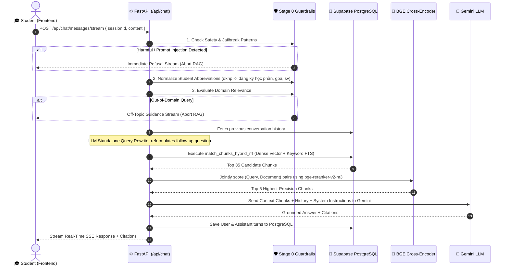
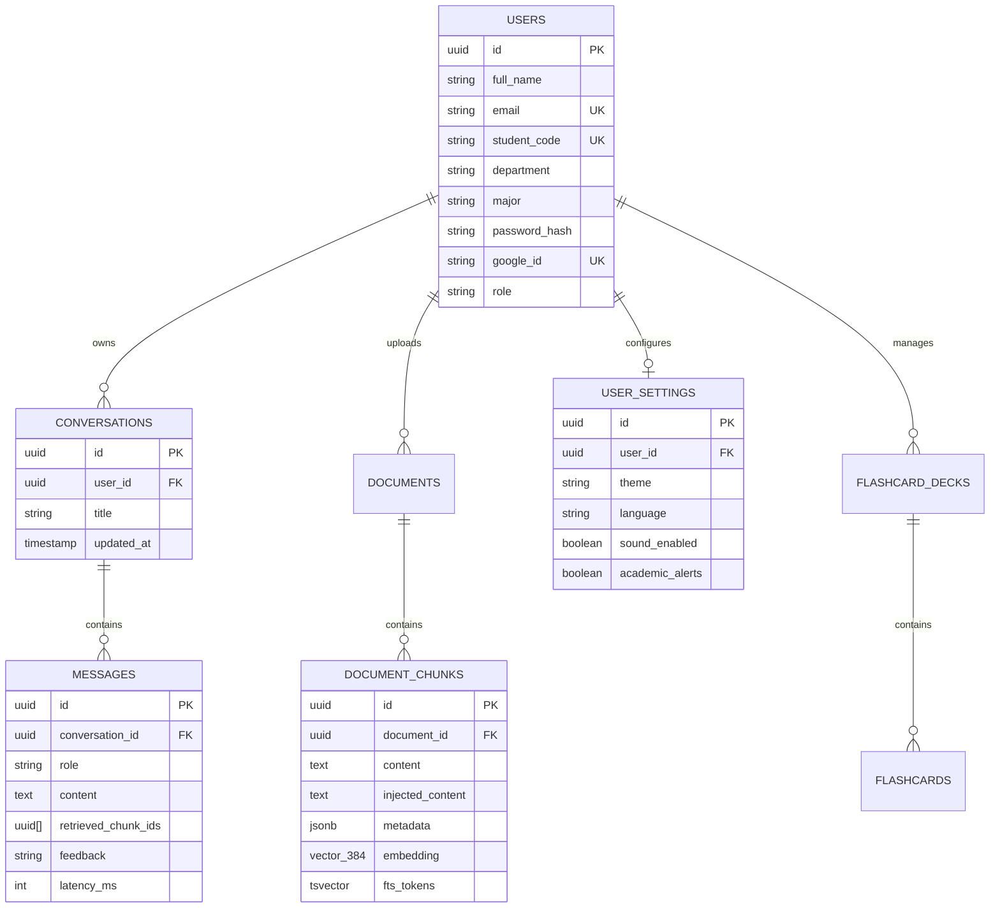

# 🧠 IUH Portal AI - Backend API Services

Welcome to the backend architecture for **IUH Portal AI** — a high-performance RAG (Retrieval-Augmented Generation) Academic Counseling Chatbot & User Authentication service built for **Industrial University of Ho Chi Minh City (IUH)**.

---

## 📐 System Architecture Overview

```
                      ┌────────────────────────────────────────┐
                      │    Client (React Frontend - Port 5173) │
                      └──────────────────┬─────────────────────┘
                                         │ HTTP / SSE
                                         ▼
                      ┌────────────────────────────────────────┐
                      │   FastAPI Web Server (backend/main.py) │
                      └───────┬──────────────┬──────────────┬──┘
                              │              │              │
                              ▼              ▼              ▼
                       /api/auth       /api/settings     /api/chat
                      (Auth & JWT)   (User Preferences)     │
                              │              │              ▼
                              ▼              │    Stage 0: Guardrails Pipeline
                       SQLAlchemy / DB       │    (Anti-Injection, Normalizer,
                       (PostgreSQL)          │     Domain Relevance Filter)
                                             │              │
                                             ▼              ▼
                                      PostgreSQL DB     Stage 1: Supabase Hybrid RRF
                                      (User Settings)   (Dense Vector + Keyword FTS)
                                                            │
                                                            ▼
                                                        Stage 2: BGE Cross-Encoder
                                                        Reranker (Top 5 Chunks)
                                                            │
                                                            ▼
                                                        Stage 3: Gemini LLM
                                                        (Grounded Response)
```

---

## 🛠️ Major Components & Core Directory Structure

```text
backend/
├── main.py                       # 🚀 Entrypoint: FastAPI App initialization, CORS & Router mounting
├── database.py                   # 🗄️ Database setup: SQLAlchemy engine, session maker & ORM models
├── requirements.txt              # 📦 Python production dependencies
├── Dockerfile                    # 🐳 Production Docker container specification
│
├── app/                          # 🧠 Core RAG Chat & Guardrails Subsystem
│   ├── guardrails/
│   │   └── query_filter.py       # 🛡️ Stage 0: Anti-Injection, Normalizer & Domain Relevance Filter
│   ├── routers/
│   │   └── chat.py               # 🛣️ Chat Router: Session history, HTTP & SSE streaming endpoints
│   ├── services/
│   │   ├── chat_service.py       # 💾 Supabase database persistence for conversations & messages
│   │   └── rag_service.py        # 🔍 Hybrid retrieval, Cross-Encoder reranking & Gemini payload builder
│   └── schemas/
│       └── chat.py               # 📑 Chat Pydantic request/response schemas
│
├── routes/                       # 🛣️ Auth & Settings API Route Handlers
│   ├── auth.py                   # Authentication, Registration, Login & Google Account Linking
│   └── settings.py               # User Profile Settings & Interface Preferences
│
├── schemas/                      # 📑 Pydantic Validation Schemas
│   ├── auth_schema.py            # Authentication & JWT schemas
│   └── settings_schema.py        # User settings payload schemas
│
├── tests/                        # 🧪 Automated Test Suites
│   └── test_guardrails.py        # 🛡️ Unit test suite for Stage 0 Guardrails
│
├── chunking/                     # 📄 PDF & Markdown text chunking scripts & Jupyter notebooks
├── Clone_handel_data/            # 🌐 Web crawling & raw data scraping scripts
└── migration_v*.sql              # 📜 Database SQL Schema & Migration scripts (v2 - v5)
```

---

## 🔄 End-to-End RAG Chat Workflow

The core academic counseling chatbot follows a **5-Stage Hybrid Pipeline** (Stage 0 Guardrails $\rightarrow$ Stage 1 Hybrid Retrieval $\rightarrow$ Stage 2 Cross-Encoder Reranking $\rightarrow$ Stage 3 LLM Generation $\rightarrow$ Stage 4 Database Persistence):



### 🛡️ Stage 0: Pre-Retrieval Guardrails & Query Sanitizer
1. **Safety & Jailbreak Shield**: Blocks prompt exfiltration attempts (*"Ignore previous instructions"*, *"System prompt"*, *"DAN mode"*, control tokens `<|im_start|>`) in both English and Vietnamese.
2. **Academic Term Normalization**: Automatically replaces informal student slang and abbreviations (`dkhp` $\rightarrow$ `đăng ký học phần`, `dkhc` $\rightarrow$ `đăng ký học cải thiện`, `gpa` $\rightarrow$ `điểm trung bình tích lũy`, `sv` $\rightarrow$ `sinh viên`, `ctdt` $\rightarrow$ `chương trình đào tạo`, `clc` $\rightarrow$ `chất lượng cao`, `cntt` $\rightarrow$ `công nghệ thông tin`, `kktx` $\rightarrow$ `ký túc xá`).
3. **Domain Relevance Evaluator**: Intercepts off-topic queries (e.g. recipes, stock advice, non-academic coding) and returns a friendly redirect message without executing expensive RAG searches.

### 🔍 Stage 1: First-Stage Hybrid Retrieval (Vector + Keyword)
* **Embedding**: Embeds the query into a 384-dimensional vector using `sentence-transformers/paraphrase-multilingual-MiniLM-L12-v2`.
* **Hybrid Search (RPC)**: Executes `match_chunks_hybrid_rrf` in Supabase PostgreSQL:
  * **Dense Vector Search**: HNSW Index (Cosine Distance) $\rightarrow$ Top 30
  * **Sparse Keyword Search**: GIN Index (`ts_rank_cd` Full-Text Search) $\rightarrow$ Top 30
  * **Reciprocal Rank Fusion (RRF)**: Combines ranks via $\text{RRF Score} = \frac{1}{60 + \text{VectorRank}} + \frac{1}{60 + \text{KeywordRank}}$.
* Returns **Top 35 candidates**.

### 🎯 Stage 2: Second-Stage Cross-Encoder Reranking
* Evaluates candidate chunks using `BAAI/bge-reranker-v2-m3`.
* Jointly scores `(query, document_text)` pairs to filter out irrelevant footers/headers.
* Selects the **Top 5 highest precision chunks**.

### 🤖 Stage 3 & 4: Generation & Persistence
* Formats retrieved context + citations.
* Invokes `gemini-2.5-flash` (with fallback to `gemini-2.0-flash`).
* Persists conversation history into PostgreSQL (`conversations` and `messages` tables).
* Supports real-time token streaming via **Server-Sent Events (SSE)** at `POST /api/chat/messages/stream`.

---

## 🗄️ PostgreSQL Database Schema & Migration Architecture

The backend database is managed via Supabase / PostgreSQL. All schema evolution scripts live in `backend/`:

### 📜 Migration History

```text
backend/
├── schema_v2_hybrid_rag.sql       # Initial RAG tables, VECTOR(384), HNSW & match_chunks_hybrid_rrf RPC
├── migration_v3_decks_and_docs.sql # Flashcard Decks & PDF Document Translation history tables
├── migration_v4_users_profile.sql  # User Profile extensions (student_code, department, major) & Password Resets
└── migration_v5_user_settings.sql  # User Interface preferences (theme, language, alerts)
```

---

### 📊 Core Database Tables



#### **1. `users` & `user_profiles`**
* Stores user authentication details, password hashes (`bcrypt`), Google OAuth IDs (`google_id`), roles (`student` vs `public`), and academic metadata (`student_code`, `department`, `major`).

#### **2. `documents` & `document_chunks` (RAG Knowledge Base)**
* **`documents`**: Stores raw document records, source URLs (`source_url`), breadcrumbs, and MD5 content hashes (`content_hash`) to avoid duplicate crawling.
* **`document_chunks`**: The core vector table:
  * `embedding VECTOR(384)`: Multilingual dense embedding generated by `paraphrase-multilingual-MiniLM-L12-v2`.
  * `fts_tokens TSVECTOR`: Automatically generated full-text search token column using PostgreSQL's `simple` text dictionary for BM25-style keyword matching.
  * `metadata JSONB`: Dynamic JSON payload storing section headers, page numbers, and URLs.

#### **3. `conversations` & `messages` (Chat Persistence & Evaluation)**
* **`conversations`**: Tracks student chat sessions, titles, and update timestamps.
* **`messages`**: Stores complete multi-turn message history, role (`user` vs `assistant`), array of citation chunk IDs (`retrieved_chunk_ids`), user feedback (`like` / `dislike`), LLM latency (`latency_ms`), and token counts.

#### **4. `user_settings`**
* Stores user-specific preferences (`theme`, `language`, `sound_enabled`, `academic_alerts`).

#### **5. `flashcard_decks`, `flashcards`, `document_translations`**
* Language learning deck classification, vocabulary cards, and file translation history (PDF/Word/PPT summary JSON).

---

### ⚡ PostgreSQL Performance & Indexing Strategy

1. **HNSW Vector Index (Dense Retrieval)**:
   ```sql
   CREATE INDEX idx_document_chunks_embedding 
   ON document_chunks USING hnsw (embedding vector_cosine_ops) 
   WITH (m = 16, ef_construction = 64);
   ```
   * Enables sub-millisecond similarity search across thousands of vector embeddings.

2. **GIN Full-Text Search Index (Sparse Keyword Retrieval)**:
   ```sql
   CREATE INDEX idx_document_chunks_fts 
   ON document_chunks USING GIN (fts_tokens);
   ```
   * Accelerates full-text keyword queries.

3. **GIN Metadata Index**:
   ```sql
   CREATE INDEX idx_document_chunks_metadata 
   ON document_chunks USING GIN (metadata);
   ```
   * Enables instant filtering on JSON metadata keys.

4. **Stored Procedure (`match_chunks_hybrid_rrf`)**:
   * Runs dense vector search and sparse FTS keyword search in parallel inside PostgreSQL, combines ranks using Reciprocal Rank Fusion (RRF constant $k=60$), and returns candidates directly to FastAPI.

---

## 🔍 Key Endpoints Summary

| Method | Endpoint | Description |
| :--- | :--- | :--- |
| `GET` | `/` | API Health Check |
| `POST` | `/api/auth/register` | Register new student user account |
| `POST` | `/api/auth/login` | Login & receive JWT access token |
| `POST` | `/api/auth/google/link` | Link Google Account / Google OAuth |
| `GET` | `/api/chat/sessions` | Fetch user conversation history for sidebar |
| `PATCH` | `/api/chat/sessions/{id}` | Rename conversation session title |
| `DELETE` | `/api/chat/sessions/{id}` | Soft-delete conversation session |
| `POST` | `/api/chat/messages` | Standard HTTP RAG chat endpoint |
| `POST` | `/api/chat/messages/stream` | Real-time SSE token-by-token streaming RAG endpoint |
| `GET` | `/api/settings` | Get user interface & AI settings |

---

## ⚡ Local Setup & Execution

### Prerequisites
* Python 3.11+
* PostgreSQL / Supabase account
* Google Gemini API Key

### 1. Environment Setup
Ensure `.env` in the root workspace contains:
```env
SUPABASE_URL="https://<your-project>.supabase.co"
SUPABASE_KEY="<your-supabase-key>"
GEMINI_API_KEY="<your-gemini-key>"
JWT_SECRET="<your-jwt-secret>"
ALGORITHM="HS256"
ACCESS_TOKEN_EXPIRE_MINUTES=60
```

### 2. Install Dependencies
```bash
pip install -r requirements.txt
```

### 3. Run Guardrails Automated Unit Tests
```bash
python tests/test_guardrails.py
```

### 4. Run Backend Server
```bash
uvicorn main:app --reload --host 0.0.0.0 --port 8000
```
* **Swagger API Docs**: `http://localhost:8000/docs`
* **ReDoc API Docs**: `http://localhost:8000/redoc`

---

## 🐳 Docker Deployment

To build and run the backend container:

```bash
docker build -t iuh_chatbot_backend .
docker run -p 8000:8000 --env-file ../.env iuh_chatbot_backend
```
