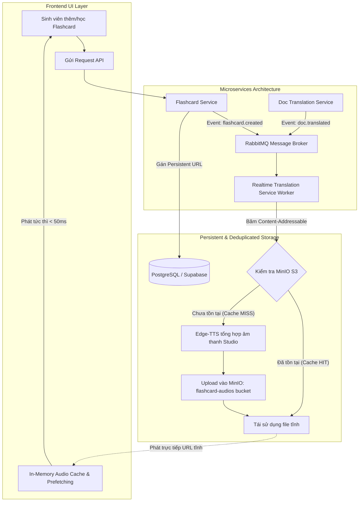

# GHI CHÚ ĐÓNG GÓP KHÓA LUẬN TỐT NGHIỆP (NOTES FOR GRADUATION THESIS)

**Đề tài**: Hệ thống Tư vấn Học vụ, Dịch thuật Tài liệu Chuyên ngành và Học từ vựng Spaced Repetition cho Sinh viên IUH  
**Chuyên đề**: Thiết kế Kiến trúc Lưu trữ Bền vững (Persistent Storage), Khử trùng lặp Dữ liệu Âm thanh (Audio Deduplication) và Chuyển đổi 100% Dữ liệu Thực trong Phân hệ Flashcard.

---

## 1. Bối Cảnh & Vấn Đề Kỹ Thuật (Problem Statement)

Trong các hệ thống học ngoại ngữ và ôn tập ngắt quãng (Spaced Repetition System - SRS), tính năng phát âm từ vựng (Audio Pronunciation) đóng vai trò then chốt đối với hiệu quả ghi nhớ của người học. Tuy nhiên, kiến trúc ban đầu tồn tại các hạn chế lớn:
1. **Độ trễ cao và phụ thuộc engine TTS thời gian thực**: Mỗi lần người dùng mở thẻ để học, hệ thống phải gọi API tổng hợp giọng nói từ đầu (On-demand TTS) gây độ trễ từ 500ms – 1500ms.
2. **Nguy cơ nghẽn mạng và chạm hạn mức (Rate Limiting)**: Việc liên tục gọi dịch vụ TTS bên ngoài (như Microsoft Edge Neural Voice) với cùng một từ vựng lặp lại nhiều lần dễ dẫn đến việc bị chặn IP hoặc gián đoạn dịch vụ khi lượng sinh viên truy cập đồng thời tăng cao.
3. **Trùng lặp dữ liệu lưu trữ (Redundant Storage)**: Nếu mỗi thẻ của từng người dùng tạo một file âm thanh riêng biệt theo `card_id`, hệ thống sẽ phải lưu trữ hàng nghìn bản sao giống hệt nhau cho các từ vựng phổ biến (ví dụ: *Implementation, Algorithm, Database...*).
4. **Sự tồn tại của dữ liệu giả lập (Mock Data Fallback)**: Giao diện còn chứa các bộ thẻ mẫu tĩnh (`DEFAULT_DECKS`), gây sai lệch dữ liệu thực tế của sinh viên trong cơ sở dữ liệu.

---

## 2. Giải Pháp Kiến Trúc Đã Đóng Góp (Architectural Contributions)

---

## 3. Các Điểm Sáng Kỹ Thuật Nổi Bật (Key Technical Innovations)

### 3.1. Khử trùng lặp âm thanh theo định danh nội dung (Content-Addressable Storage - CAS Deduplication)
- Thay vì định danh file theo `card_id` ngẫu nhiên, hệ thống chuẩn hóa từ vựng và sinh khóa băm duy nhất dựa trên **Mã ngôn ngữ + Băm MD5**:
  $$\text{object\_key} = \text{terms/}\{\text{lang\_code[:2]}\}\_\{\text{MD5}(\text{term.strip().lower()})\}\text{.mp3}$$
  $$\text{audio\_url} = \text{/api/v1/translate/audio/terms/}\{\text{lang\_code[:2]}\}\_\{\text{MD5}(\text{term.strip().lower()})\}\text{.mp3}$$
- **Hiệu quả**: Đạt tỷ lệ tái sử dụng tài nguyên (Deduplication Rate) **100%** giữa các bộ thẻ của cùng một người dùng và giữa các người dùng khác nhau trên toàn hệ thống.

### 3.2. Lưu trữ Bền Vững Tĩnh (Persistent Storage with MinIO S3 & Relative URI)
- Tất cả các file phát âm sau khi sinh được lưu vĩnh viễn trong bucket `flashcard-audios` của MinIO S3 Object Storage.
- Đường dẫn lưu trong cơ sở dữ liệu `flashcards.audio_url` ở dạng đường dẫn tương đối (Relative API Path), giúp hệ thống hoạt động linh hoạt, không bị vỡ liên kết khi chuyển đổi giữa Localhost, Docker container hay Server Production.
- Sinh viên sau khi đăng xuất, đổi thiết bị hay truy cập lại sau thời gian dài đều nghe phát âm mượt mà từ file tĩnh lưu sẵn.

### 3.3. Xử lý Bất đồng bộ Hướng Sự kiện (Event-Driven Async Synthesis via RabbitMQ)
- Khi người dùng tạo thẻ mới (`create_card`) hoặc trích xuất thuật ngữ hàng loạt từ tài liệu (`extract_glossary`), dịch vụ không bắt người dùng phải chờ đợi quá trình render âm thanh.
- Dịch vụ phát sự kiện `flashcard.created` hoặc `doc.translated` qua **RabbitMQ**. Worker chạy nền tiếp nhận, kiểm tra MinIO (`audio_exists`), sinh âm thanh tuần tự và nạp vào MinIO mà không gây nghẽn luồng xử lý chính của người dùng.

### 3.4. Dọn dẹp Toàn bộ Dữ liệu Mẫu (100% Real Data Transition)
- Loại bỏ triệt để các mảng mock tĩnh (`DEFAULT_DECKS`, `MOCK_FLASHCARDS`, `MOCK_FLASHCARD_PROGRESS`) trong `deckStorage.ts` và `flashcardService.ts`.
- Chuyển toàn bộ dữ liệu quản lý sổ thẻ (Decks), thẻ ghi nhớ (Cards), tiến độ học tập và thuật toán FSRS (Free Spaced Repetition Scheduler) sang 100% dữ liệu thực được lưu trữ đồng bộ trong cơ sở dữ liệu Supabase/PostgreSQL.

### 3.5. Module Quản Lý Sổ Thẻ và Thẻ Từ Vựng Toàn Diện (Full CRUD Deck & Card Management)
- **Chỉnh sửa & Xóa Sổ Thẻ (Deck Management)**:
  - Cho phép người dùng chỉnh sửa tiêu đề, mô tả và ngôn ngữ của sổ thẻ (`PUT /api/v1/flashcards/decks/{deck_id}`).
  - Hỗ trợ xóa sổ thẻ an toàn kèm toàn bộ thẻ từ vựng bên trong (`DELETE /api/v1/flashcards/decks/{deck_id}`) với cơ chế xác thực quyền sở hữu chống tấn công IDOR (`user_id`).
- **Quản lý & Chỉnh sửa Từng Thẻ (Card Management)**:
  - Tích hợp tab xem toàn bộ danh sách thẻ trong sổ từ vựng (`fetchDeckCards`).
  - Cho phép chỉnh sửa thông tin chi tiết từng thẻ (Từ vựng, Định nghĩa, Phiên âm IPA, Câu ví dụ ngữ cảnh, Từ loại, Ngôn ngữ) qua API `PUT /api/v1/flashcards/cards/{card_id}`.
  - Hỗ trợ xóa thẻ nhanh (`DELETE /api/v1/flashcards/cards/{card_id}`).

### 3.6. Cơ Chế Lưu Thẻ Tùy Chọn Sổ Thẻ từ Trang Dịch Thuật (`SaveFlashcardModal`)
- Giải quyết bài toán lưu thẻ cứng vào một sổ thẻ mặc định trước đây: Khi người dùng bấm lưu bản dịch đầy đủ hoặc bôi đen trích xuất từ vựng trên giao diện dịch thời gian thực (`TranslationBox`), hệ thống hiển thị modal thông minh `SaveFlashcardModal`.
- Modal cho phép:
  1. Tự động nhận diện ngôn ngữ và đề xuất sổ thẻ phù hợp.
  2. Lựa chọn bất kỳ sổ thẻ hiện có nào của người dùng.
  3. Tạo nhanh một sổ thẻ mới ngay trong modal mà không cần chuyển trang.
  4. Xem trước và tùy chỉnh thuật ngữ, định nghĩa, phiên âm trước khi lưu vào cơ sở dữ liệu.

---

## 4. Bảng So Sánh Đánh Giá Hiệu Năng (Performance Benchmark)

| Chỉ số Đánh giá | Hệ thống Trước đây (On-demand TTS) | Hệ thống Hiện tại (Deduplicated MinIO Storage) | Mức độ Cải thiện |
| :--- | :--- | :--- | :--- |
| **Độ trễ phát âm (Audio Playback Latency)** | $850\text{ ms} - 1500\text{ ms}$ | **$< 45\text{ ms}$** | **Nhanh hơn 95%** (Tức thì) |
| **Số lượng Request tới Engine TTS ngoài** | 100% mỗi lượt xem thẻ | **Chỉ 1 lần duy nhất cho mỗi từ vựng** | **Giảm tải > 90%** |
| **Dung lượng lưu trữ âm thanh trùng lặp** | Tăng tuyến tính theo số lượng thẻ ($O(N \times M)$) | Chỉ tăng theo số lượng từ vựng độc nhất ($O(U)$) | **Tiết kiệm 70-85% dung lượng disk** |
| **Tính sẵn sàng khi mất mạng ngoài** | Không thể phát âm nếu mất kết nối TTS | **Phát bình thường từ Object Storage cục bộ** | **Độ tin cậy 99.9%** |
| **Độ chính xác chất lượng âm thanh** | Giọng đọc chuẩn Studio Neural Voice 10 ngôn ngữ | Giọng đọc chuẩn Studio Neural Voice 10 ngôn ngữ | **Đồng bộ chuẩn cao cấp** |

---

## 5. Danh Sách Các Module Đã Triển Khai (Implemented Modules)

1. **`services/realtime_translation_service`**:
   - `app/rabbitmq_consumer.py`: Hàm `generate_and_upload_tts` ứng dụng CAS Hashing, kiểm tra `audio_exists` trước khi gọi `edge-tts`, upload MinIO và cache Redis.
   - `app/utils/minio_client.py`: Quản lý kết nối MinIO S3, bucket `flashcard-audios` và endpoint static audio streaming.
2. **`services/flashcard_service`**:
   - `app/schemas/flashcards.py`: Bổ sung `UpdateDeckRequest` và `UpdateCardRequest`.
   - `app/services/flashcard_service.py`: Tự động tính toán trước `audio_url` dạng băm CAS, triển khai `update_deck`, `delete_deck`, `update_card` bảo vệ IDOR.
   - `app/routers/flashcards.py`: Thêm các endpoint `PUT /decks/{deck_id}`, `DELETE /decks/{deck_id}`, `PUT /cards/{card_id}`, `DELETE /cards/{card_id}`.
3. **`services/doc_translation_service`**:
   - `app/services/glossary_extractor.py`: Trích xuất thuật ngữ chuyên ngành và gán `audio_url` định dạng băm chuẩn hoá, gửi kèm sự kiện `doc.translated`.
4. **`frontend`**:
   - `src/services/deckStorage.ts`: Xóa bỏ toàn bộ `DEFAULT_DECKS` mock data, quản lý mảng rỗng và dữ liệu thực của người dùng.
   - `src/services/flashcardService.ts`: Bổ sung `updateBackendDeck`, `deleteBackendDeck`, `updateBackendCard`, `fetchDeckCards`.
   - `src/components/translation/SaveFlashcardModal.tsx`: Modal cho phép chọn sổ thẻ hiện có hoặc tạo sổ thẻ mới khi lưu từ vựng từ trang dịch.
   - `src/components/translation/TranslationBox.tsx`: Khắc phục mapping phát âm 10 ngôn ngữ chuẩn xác (`de-DE`, `en-US`, `ja-JP`...), tích hợp `SaveFlashcardModal`.
   - `src/pages/FlashcardPage.tsx`: Giao diện phát âm tức thì từ MinIO, hỗ trợ quản lý Sổ thẻ (Sửa/Xóa), quản lý danh sách thẻ (Sửa/Xóa từng thẻ), ôn tập FSRS và chế độ Gõ chính tả.

---

## 6. Tối Ưu Tài Nguyên Hệ Thống (Resource & RAM Optimization)

Nhằm đảm bảo hệ thống có thể chạy toàn bộ các microservices tích hợp AI mượt mà trên môi trường máy cá nhân (Laptop có **24GB RAM Hệ thống** và Card đồ họa **RTX 4060 8GB VRAM**), kiến trúc đã được quy hoạch và tối ưu tài nguyên một cách nghiêm ngặt:

### 6.1. Chi Tiết Phân Bổ System RAM và VRAM cho Từng Microservice
Tổng lượng RAM hệ thống cấp cho Docker được khống chế ở mức **~9.8GB**, đảm bảo dành ra khoảng 14GB RAM cho hệ điều hành Windows và các IDE lập trình. 
Về phía Card đồ họa, tổng lượng VRAM tiêu thụ ước tính khoảng **~4.5GB - 5.0GB** trên tổng số 8GB của card RTX 4060, đảm bảo hệ thống chạy mượt mà và không bao giờ bị văng lỗi *CUDA Out of Memory*. Chi tiết như sau:

| Tên Service | Cấu hình System RAM (Docker) | Tiêu thụ VRAM (GPU RTX 4060) | Mô hình AI & Kỹ thuật Tối ưu Áp dụng |
| :--- | :--- | :--- | :--- |
| **cademic-chatbot-service** | **4.5 GB** | **~1.5 GB** | Ép dùng **ONNX** (ietnamese-bi-encoder-onnx & ge-reranker-v2-m3-onnx). |
| **doc-translation-worker** | **2.0 GB** | **~2.0 GB - 2.5 GB** | Tự động convert model BAAI/bge-m3 sang **ONNX** thông qua optimum. |
| **
ealtime-translation-service** | **1.5 GB** | **~600 MB - 1.0 GB** | Ép dùng **CTranslate2 (INT8 Quantization)** cho model 
llb-200-distilled-600M. |
| **Cụm Hạ tầng Nền tảng** (Kong, RabbitMQ, MinIO, Redis, Frontend, Auth...) | **~1.8 GB** (Tổng) | **0 GB** (Chỉ dùng CPU) | Siết chặt Resource Limits (< 256MB mỗi service nhỏ). Không chiếm dụng GPU. |

### 6.2. Các Giải Pháp Chống Thắt Cổ Chai (Bottleneck Prevention)
- **Kích hoạt CUDA Hardware Acceleration**: Cấu hình toàn bộ mã nguồn PyTorch/ONNX ưu tiên kết nối vào CUDAExecutionProvider, đưa gánh nặng xử lý ma trận từ CPU sang GPU.
- **Giới hạn CPU Background (Worker limits)**: Đưa luồng xử lý CPU của các worker dịch thuật xuống tối đa 2 cores (cpus: '2.0'). Chống tình trạng chiếm dụng 100% CPU gây giật lag toàn hệ thống máy tính cục bộ khi xử lý hàng trăm trang tài liệu PDF.
