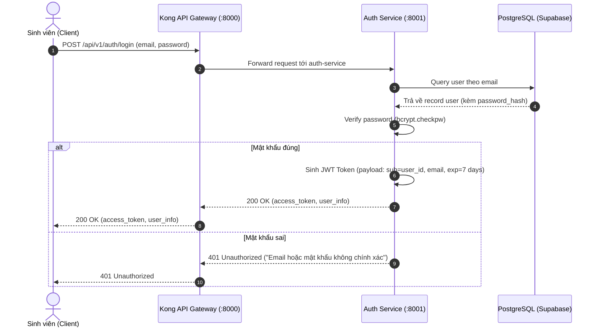

# Ghi Chú Kỹ Thuật Khóa Luận: Authentication & User Service (`auth_service`)

Tài liệu này ghi chép lại toàn bộ bài toán kỹ thuật, giải pháp kiến trúc, mô hình dữ liệu và các quyết định thiết kế của **Auth Service** để phục vụ viết báo cáo Khóa luận tốt nghiệp và trả lời phản biện trước Hội đồng.

---

## 1. Bài toán và Mục tiêu thiết kế
Trong hệ thống Microservices phục vụ hàng nghìn sinh viên trường Đại học Công nghiệp TP.HCM (IUH), dịch vụ Quản lý Định danh & Xác thực (`auth_service`) phải giải quyết các thách thức:
1. **Xác thực phi tập trung (Stateless Authentication)**: Cho phép API Gateway (Kong) và các microservice khác xác thực người dùng mà không cần gọi ngược lại Database của `auth_service` ở mỗi request.
2. **Quản lý Hồ sơ Sinh viên IUH**: Lưu trữ thông tin cá nhân hóa (Mã số sinh viên `student_code`, Khoa `department`, Ngành học `major`, Email sinh viên).
3. **Bảo mật Tài khoản & Khôi phục Mật khẩu**: Quản lý quy trình Reset Password bằng mã OTP 6 chữ số có thời hạn (TTL) và mã hóa một chiều bảo mật cao.
4. **Phòng chống Lỗ hổng Truy cập Trái phép (IDOR - Insecure Direct Object Reference)**: Đảm bảo người dùng chỉ có thể thao tác trên dữ liệu thuộc quyền sở hữu của chính họ.

---

## 2. Kiến trúc & Công nghệ Sử dụng

| Thành phần | Công nghệ / Thư viện | Vai trò |
| :--- | :--- | :--- |
| **Framework** | FastAPI (Python 3.11+) | Xây dựng RESTful API bất đồng bộ hiệu năng cao |
| **Xác thực Token** | `PyJWT` (JSON Web Token - HS256) | Cấp phát Access Token chứa `user_id`, `email`, `role`, `exp` |
| **Mã hóa Mật khẩu** | `passlib[bcrypt]` / `bcrypt` | Hash mật khẩu với Salt ngẫu nhiên, chống tấn công Rainbow Table |
| **Cơ sở dữ liệu** | PostgreSQL (Supabase) | Lưu trữ bảng `users`, `password_resets` |
| **API Gateway Integration** | Kong API Gateway JWT Plugin | Kong kiểm tra tính hợp lệ của chữ ký JWT ngay tại Gateway |

---

## 3. Các Luồng Nghiệp vụ Cốt lõi (Core Workflows)

### 3.1. Luồng Đăng nhập & Cấp phát JWT Token


### 3.2. Luồng Khôi phục Mật khẩu qua OTP
1. **Gửi yêu cầu OTP**: Client gửi `POST /api/v1/auth/forgot-password` với `email`.
2. **Sinh mã OTP**: Hệ thống sinh ngẫu nhiên mã số 6 chữ số (`random.randint(100000, 999999)`), lưu vào bảng `password_resets` với thời hạn hết hạn 15 phút (`expires_at = now() + 15 mins`).
3. **Xác nhận OTP & Đổi mật khẩu**: Client gửi `POST /api/v1/auth/reset-password` (kèm `email`, `otp_code`, `new_password`). Service kiểm tra hợp lệ, hash mật khẩu mới và vô hiệu hóa mã OTP.

---

## 4. Mô hình Dữ liệu (Database Schema)

```sql
-- Bảng Người dùng (Đã tích hợp Profile Sinh viên IUH)
CREATE TABLE users (
    id UUID PRIMARY KEY DEFAULT gen_random_uuid(),
    full_name VARCHAR(255),
    email VARCHAR(255) UNIQUE NOT NULL,
    student_code VARCHAR(50) UNIQUE DEFAULT NULL,   -- MSSV IUH
    department VARCHAR(150) DEFAULT NULL,           -- Khoa / Viện
    major VARCHAR(150) DEFAULT NULL,                -- Ngành học
    phone_number VARCHAR(20) DEFAULT NULL,
    password_hash VARCHAR(255) NOT NULL,
    created_at TIMESTAMP WITH TIME ZONE DEFAULT CURRENT_TIMESTAMP,
    updated_at TIMESTAMP WITH TIME ZONE DEFAULT CURRENT_TIMESTAMP
);

-- Bảng Quản lý OTP Đặt lại Mật khẩu
CREATE TABLE password_resets (
    id UUID PRIMARY KEY DEFAULT gen_random_uuid(),
    email VARCHAR(255) NOT NULL,
    otp_code VARCHAR(10) NOT NULL,
    expires_at TIMESTAMP WITH TIME ZONE NOT NULL,
    is_used BOOLEAN DEFAULT FALSE,
    created_at TIMESTAMP WITH TIME ZONE DEFAULT CURRENT_TIMESTAMP
);
CREATE INDEX idx_password_resets_email_otp ON password_resets(email, otp_code);
```

---

## 5. Điểm sáng Kỹ thuật để Báo cáo Khóa luận
1. **Kong API Gateway Offloading**: Thay vì để mỗi microservice tự parse và verify token gây trùng lặp code, Kong Gateway xác thực JWT tại tầng ngoài cùng, gán header `X-Consumer-Custom-ID: user_id` và forward vào trong.
2. **Bảo mật Phòng thủ theo chiều sâu (Defense-in-depth)**: Dù Kong đã verify ở Gateway, các service nội bộ vẫn dùng helper `get_current_user` để giải mã token kiểm tra tính nhất quán và ngăn ngừa bypass.
3. **Phân tách trách nhiệm hoàn toàn (Single Responsibility)**: Service chỉ quản lý Identity & User Metadata, không chứa logic nghiệp vụ của Chatbot, Flashcard hay Translation.
