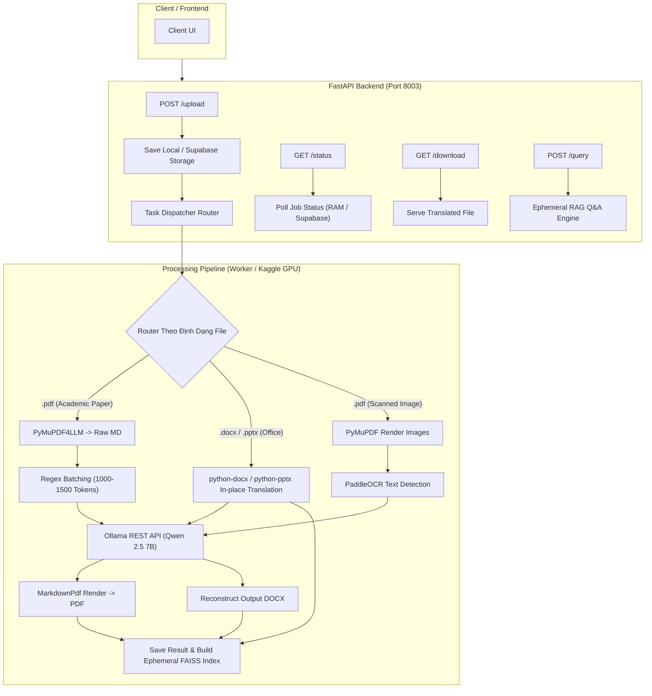

# 📄 Document Translation & Ephemeral RAG Service

Microservice xử lý **Dịch thuật Tài liệu Đa định dạng (Academic PDF, Word, PowerPoint, PDF Scan)** và **Hỏi đáp RAG Tạm thời (Ephemeral RAG Q&A)** thuộc Hệ thống Tư vấn Học vụ IUH.

---

## 🚀 1. Tổng Quan Kiến Trúc (Architecture & Workflow)

Hệ thống được thiết kế theo kiến trúc **Asynchronous Worker Pattern** giúp tách rời phần API Gateway nhẹ nhàng (FastAPI) và các tác vụ tính toán AI nặng (Ollama Qwen 2.5, PaddleOCR) chạy trên môi trường Kaggle GPU (miễn phí T4/P100).



---

## 🛠️ 2. Các Luồng Xử Lý Chi Tiết (Pipeline Features)

### 📄 A. Dịch Bài Báo Học Thuật (Academic PDF -> MD -> PDF)
1. **Parse**: Dùng `pymupdf4llm` ép file PDF gốc thành `raw.md`, bóc tách tiêu đề, bảng biểu và lưu liên kết ảnh.
2. **Batching**: Phân tách file Markdown bằng dấu ngắt dòng `\n\n` thành các Batches **1000 - 1500 tokens**. Tránh tràn context bộ nhớ của Ollama.
3. **LLM Translation**: Gửi từng batch lên Ollama qua REST API với system prompt nghiêm ngặt:
   - GIỮ NGUYÊN cấu trúc Markdown (`#`, `*`, `tables`, `links`).
   - GIỮ NGUYÊN các công thức toán học LaTeX (`$`, `$$`).
4. **Reconstruct**: Ghép bản dịch trả về thành `translated.md` và render thành file PDF bằng `MarkdownPdf`.

### 📝 B. Dịch Văn Phòng (Word `.docx` & PowerPoint `.pptx`) - In-Place
- **Word (.docx)**: Duyệt qua `doc.paragraphs` (đoạn text > 5 ký tự) và `doc.tables` (các cell). Dịch qua Ollama và ghi đè văn bản, giữ nguyên thống nhất định dạng đoạn.
- **PowerPoint (.pptx)**: Duyệt qua `slide.shapes`, truy cập `shape.text_frame.paragraphs`, dịch và ghi đè. Tự động bật thuộc tính `word_wrap = True` (AutoFit) để text tiếng Việt không bị tràn khung.

### 🖼️ C. Dịch File Scan (PDF Ảnh Scan)
1. **Extract**: PyMuPDF render trang PDF thành các ảnh PNG (200 DPI).
2. **OCR**: PaddleOCR nhận diện các khối văn bản (Text Blocks).
3. **Build Output**: Gửi text blocks cho Ollama dịch và dùng `python-docx` tái tạo thành file Word mới.

### ⚡ D. Ephemeral RAG Q&A (Hỏi Đáp Tạm Thời)
- **Hierarchical Chunking**: Chia nhỏ bản dịch tiếng Việt thành các chunk ~400 tokens (overlap 15%).
- **In-Memory FAISS**: Tạo index vector trên RAM và tự hủy sau phiên làm việc, hỗ trợ Hybrid Search (BM25 + Vector embedding).

---

## 📂 3. Cấu Trúc Thư Mục Dự Án

```text
services/doc_translation_service/
├── app/
│   ├── main.py                    # Entrypoint ứng dụng FastAPI
│   ├── routers/
│   │   └── documents.py           # Endpoints: /upload, /status, /download, /query
│   ├── services/
│   │   ├── ollama_translator.py   # Client Ollama REST API + Regex Batching
│   │   ├── markdown_pdf_service.py # Bóc tách PDF <-> Markdown & Render PDF
│   │   ├── docx_pptx_service.py    # Xử lý In-place Word & PowerPoint
│   │   ├── scanned_pdf_service.py  # PyMuPDF + PaddleOCR cho PDF Scan
│   │   ├── rag_engine.py          # Engine Ephemeral RAG Q&A
│   │   └── vector_store.py        # In-memory FAISS Vector Store
│   ├── tasks/
│   │   └── pdf_worker.py          # Async Task Dispatcher & Status Store
│   └── utils/
│       └── logger.py              # Centralized Logger
├── kaggle/
│   ├── setup_kaggle_env.sh        # Bash script cài Ollama & OCR trên Kaggle
│   └── kaggle_worker.py           # Script chạy Ngrok tunnel trên Kaggle
├── temp_uploads/                  # Thư mục chứa file upload tạm
├── temp_translated/               # Thư mục chứa file kết quả dịch
├── requirements.txt               # Các thư viện Python phụ thuộc
└── README.md                      # Tài liệu hướng dẫn sử dụng
```

---

## ⚙️ 4. Hướng Dẫn Cấu Hình & Chạy Dự Án

### 🔹 Bước 1: Chuẩn Bị Môi Trường Cục Bộ (Local)

1. Cài đặt các thư viện cần thiết:
```bash
pip install -r requirements.txt
```

2. Cập nhật Database Schema (Nếu dùng Supabase PostgreSQL):
```bash
psql $DATABASE_URL -f db/migration_v7_document_translation_updates.sql
```

3. Cấu hình biến môi trường (`.env`):
```env
OLLAMA_HOST=http://localhost:11434  # Hoặc URL Ngrok từ Kaggle
OLLAMA_MODEL=qwen2.5:7b
SUPABASE_URL=https://your-supabase-project.supabase.co
SUPABASE_KEY=your-supabase-anon-key
```

---

### 🔹 Bước 2: Chạy AI Engine Trực Tiếp Trên Kaggle GPU (Tùy chọn)

Nếu bạn chạy Ollama trên Kaggle để lấy GPU miễn phí:

1. Tạo 1 Kaggle Notebook (bật GPU T4 x2).
2. Chạy lệnh setup môi trường:
```bash
!bash services/doc_translation_service/kaggle/setup_kaggle_env.sh
```
3. Khởi chạy Ngrok Tunnel:
```bash
!python services/doc_translation_service/kaggle/kaggle_worker.py
```
4. Sao chép **Public Ngrok URL** trả về và gán vào biến môi trường `OLLAMA_HOST` của local server FastAPI.

---

### 🔹 Bước 3: Khởi Chạy Local FastAPI Service

Chạy server tại cổng `8003`:
```bash
python app/main.py
```
Hoặc dùng Uvicorn trực tiếp:
```bash
uvicorn app.main:app --host 0.0.0.0 --port 8003 --reload
```

---

## 📑 5. Danh Sách API Endpoints

### 1. Upload File Tài Liệu
- **Endpoint**: `POST /api/v1/documents/upload`
- **Body (`form-data`)**:
  - `file`: File upload (`.pdf`, `.docx`, `.pptx`)
  - `source_lang`: Ngôn ngữ nguồn (Default: `en`)
  - `target_lang`: Ngôn ngữ đích (Default: `vi`)
  - `is_scanned`: `true` / `false` (Nếu là PDF dạng ảnh scan)
- **Response**: `202 Accepted` kèm `doc_id`.

### 2. Trắc Nghiệm Tiến Độ (Polling Status)
- **Endpoint**: `GET /api/v1/documents/{doc_id}/status`
- **Response**:
```json
{
  "ok": true,
  "data": {
    "doc_id": "uuid-v4",
    "status": "COMPLETED",
    "progress": 100,
    "message": "Đã hoàn thành dịch thuật thành công!",
    "translated_file_url": "/api/v1/documents/uuid-v4/download"
  }
}
```

### 3. Tải Về Kết Quả Dịch
- **Endpoint**: `GET /api/v1/documents/{doc_id}/download`
- **Response**: Binary File (`.pdf`, `.docx`, hoặc `.pptx`).

### 4. Hỏi Đáp Ephemeral RAG Trực Tiếp Trên Tài Liệu
- **Endpoint**: `POST /api/v1/documents/{doc_id}/query`
- **Body (`json`)**:
```json
{
  "query": "Bài báo này đề xuất phương pháp tối ưu nào?"
}
```
