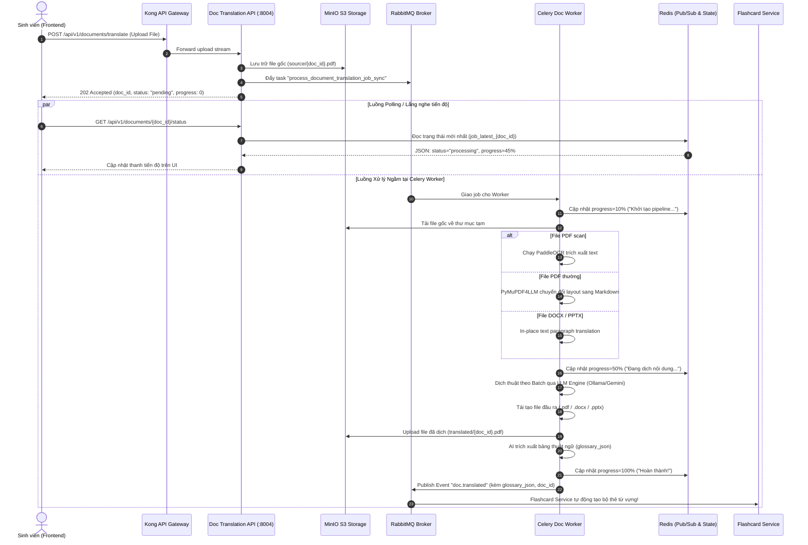

# Ghi Chú Kỹ Thuật Khóa Luận: Document Translation & OCR Async Pipeline (`doc_translation_service`)

Tài liệu này tổng hợp toàn bộ bài toán kỹ thuật, kiến trúc xử lý bất đồng bộ, pipeline trích xuất đa định dạng và các quyết định thiết kế của **Document Translation Service** để phục vụ viết báo cáo Khóa luận tốt nghiệp.

---

## 1. Bài toán và Mục tiêu thiết kế
Dịch tài liệu học thuật (sách giáo trình, bài báo khoa học IEEE/Springer, slide bài giảng, đề cương môn học) là tác vụ cực kỳ nặng về mặt tính toán (Compute-Intensive) và I/O. Các thách thức chính:
1. **Tránh Timeout kết nối HTTP**: Dịch một file PDF 20 trang có thể mất từ 1 đến 3 phút. Nếu xử lý đồng bộ trong request HTTP, kết nối sẽ bị ngắt ($504\text{ Gateway Timeout}$).
2. **Đa dạng Định dạng File & Bố cục phức tạp**: Hệ thống phải xử lý trơn tru:
   - **PDF thông thường**: Giữ nguyên cấu trúc bảng biểu, công thức toán, tiêu đề (sử dụng `PyMuPDF4LLM`).
   - **PDF dạng scan / ảnh chụp**: Tự động nhận diện văn bản bằng OCR (`PaddleOCR`).
   - **Microsoft Office (.docx, .pptx)**: Dịch tại chỗ (In-place translation) giữ nguyên định dạng format, layout trang và slide thuyết trình.
3. **Giám sát Tiến độ Thời gian thực (Real-time Progress Tracking)**: Phản hồi tiến độ chi tiết từ $0\%$ đến $100\%$ kèm trạng thái trực quan cho người dùng qua Redis Pub/Sub / Polling.
4. **Trích xuất Thuật ngữ Tự động (AI Glossary Extraction)**: Bóc tách danh mục từ vựng chuyên ngành xuất hiện trong tài liệu kèm ngữ cảnh và phát tán sự kiện (Event) để tạo Flashcard tự động.

---

## 2. Kiến trúc Hệ thống & Luồng Bất đồng bộ

---

## 3. Pipeline Xử lý Chi tiết theo Định dạng File

| Định dạng File | Công cụ Trích xuất | Cơ chế Xử lý & Giữ Layout | Định dạng Đầu ra |
| :--- | :--- | :--- | :--- |
| **PDF Văn bản** | `pymupdf4llm` | Trích xuất thành Markdown có cấu trúc, chia chunk theo Heading/Paragraph, dịch Markdown và biên dịch lại bằng `weasyprint`/`reportlab` | `.pdf` |
| **PDF Scan / Ảnh** | `PyMuPDF` + `PaddleOCR` | Render từng trang PDF thành ảnh PNG $\rightarrow$ Chạy mô hình OCR tiếng Việt/Anh $\rightarrow$ Dịch text OCR | `.docx` / `.pdf` |
| **Word (.docx)** | `python-docx` | Duyệt qua từng `Paragraph` và ô `Table.Cell`, thay thế text gốc bằng bản dịch mà không làm hỏng Styles / Margins | `.docx` |
| **PowerPoint (.pptx)** | `python-pptx` | Duyệt qua từng `Slide` $\rightarrow$ `Shape` $\rightarrow$ `TextFrame` $\rightarrow$ `Paragraph`, dịch văn bản và giữ nguyên kích thước font | `.pptx` |

---

## 4. Quản lý Tài nguyên & Thu dọn Rác (Garbage Collection)
1. **Docker Resource Limits**: Trong `docker-compose.yml`, container `doc-translation-worker` được giới hạn cứng `cpus: '2.5'`, `memory: 2.5G` và reservation `512M`. Điều này đảm bảo khi thực hiện OCR hoặc parse tài liệu 100 trang, worker không thể chiếm quá 2.5GB RAM của máy chủ.
2. **Cơ chế Dọn dẹp File Tạm ([cleanup_worker.py](file:///g:/Khoa_Luan/IUH_Academic_Counseling_Chatbot/services/doc_translation_service/app/tasks/cleanup_worker.py))**:
   - Mọi thao tác xử lý file cục bộ đều nằm trong thư mục `tempfile.TemporaryDirectory()`.
   - Khối `try...finally` đảm bảo xóa sạch file trung gian ngay khi kết thúc job.
   - Định kỳ Celery Beat quét và xóa các file tạm mồ côi quá 24h.

---

## 5. Điểm sáng Kỹ thuật để Báo cáo Khóa luận
1. **Kiến trúc Bất đồng bộ Chuẩn Công nghiệp (Event-Driven Async Pipeline)**: Sự kết hợp giữa Celery + RabbitMQ + Redis Pub/Sub + MinIO S3 tạo nên một hệ thống xử lý file đạt chuẩn doanh nghiệp (Production-ready), có khả năng mở rộng quy mô (Horizontal Scaling) chỉ bằng cách tăng số lượng container Worker.
2. **Khả năng Giữ nguyên Định dạng (Layout Preservation)**: Giải quyết được "nỗi đau" lớn nhất của việc dịch tài liệu là bị nhảy trang, mất bảng biểu hoặc vỡ bố cục slide.
3. **Cầu nối Tự động hóa với Hệ sinh thái Flashcard**: Biến quá trình đọc tài liệu dịch thành hành động học tập chủ động bằng cách tự động sinh Glossary và bắn event lên Message Broker.
4. **Tối ưu hóa Bóc tách và Dịch thuật với Semantic & Parallel Processing**:
   - **Context-Aware Translation (Tiêm Ngữ Cảnh)**: Cải tiến quy trình truyền thống bằng cách dùng AI để trích xuất Glossary (bộ từ vựng) trước, sau đó tiêm vào *System Prompt* của quá trình dịch. Điều này giải quyết triệt để lỗi LLM dịch sai thuật ngữ chuyên ngành do thiếu ngữ cảnh.
   - **Markdown Hierarchical Chunking**: Giải quyết giới hạn Context Window của LLM bằng cách cắt nội dung theo cấp độ *Semantic* của Markdown (dựa trên các thẻ `#`, `##`). Đảm bảo một bảng biểu (Table), khối mã (Code) hay công thức toán học (LaTeX) không bao giờ bị cắt đôi, giữ lại cấu trúc hoàn hảo 100%.
   - **Continuous Batching & Parallel Inference**: Tích hợp ThreadPoolExecutor đa luồng gửi yêu cầu đồng thời lên engine LLM (ví dụ: vLLM hoặc Ollama) trên GPU (2x T4 30GB VRAM). Tính năng này đẩy thông lượng dịch lên gấp 4 lần so với vòng lặp đồng bộ, khắc phục bottleneck I/O khi gọi mô hình.

