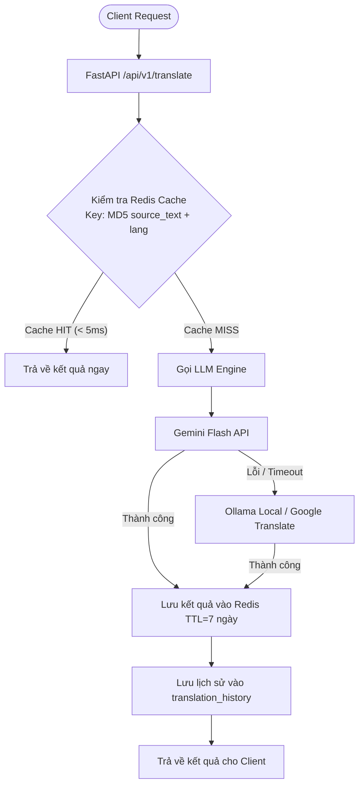
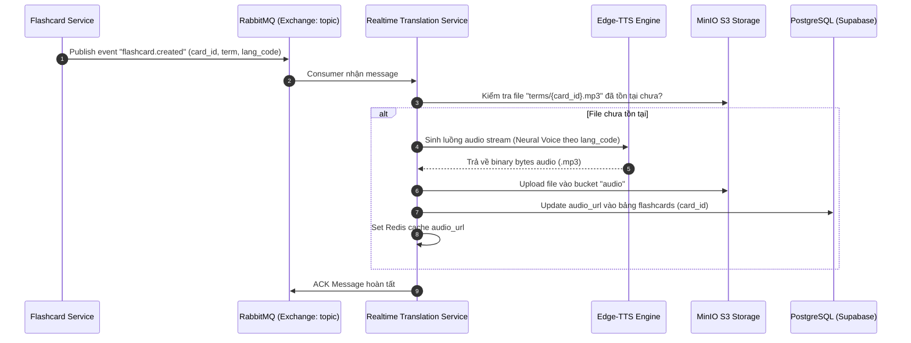

# Ghi Chú Kỹ Thuật Khóa Luận: Real-time Translation & Audio Synthesis (`realtime_translation_service`)

Tài liệu này tổng hợp toàn bộ bài toán kỹ thuật, giải pháp kiến trúc, mô hình dữ liệu và các quyết định thiết kế của **Real-time Translation & TTS Service** để phục vụ viết báo cáo Khóa luận tốt nghiệp.

---

## 1. Bài toán và Mục tiêu thiết kế
Dịch vụ Dịch thuật Tức thời & Tổng hợp Giọng nói (`realtime_translation_service`) đảm nhận việc hỗ trợ sinh viên học ngoại ngữ và tra cứu tài liệu học thuật với các yêu cầu khắt khe:
1. **Độ trễ siêu thấp (Low Latency < 100ms)**: Sinh viên khi tra từ đơn hoặc câu ngắn cần kết quả ngay lập tức để không làm gián đoạn trải nghiệm đọc tài liệu.
2. **Khả năng chịu lỗi & Multi-Provider Fallback**: Tự động chuyển đổi giữa các Provider dịch thuật (Gemini $\rightarrow$ Local Ollama $\rightarrow$ Google Translator) khi gặp sự cố mạng hoặc hết hạn mức API (Rate limit / Quota exceeded).
3. **Bộ nhớ đệm thông minh (Redis Caching)**: Tránh gọi lại AI Model đối với những từ vựng/câu tra cứu phổ biến, giảm chi phí API và đưa latency về mức $< 5\text{ ms}$.
4. **Tự động Tổng hợp Giọng nói (Text-To-Speech - TTS)**: Tích hợp `edge_tts` để sinh file phát âm chuẩn bản ngữ cho hơn 10 ngôn ngữ (Anh, Việt, Đức, Nhật, Hàn, Trung, Pháp...), lưu trữ tĩnh trên MinIO S3.
5. **Giao tiếp Hướng sự kiện (Event-Driven Integration)**: Tự động lắng nghe event từ RabbitMQ khi có Flashcard mới được tạo để sinh file âm thanh ngầm.

---

## 2. Kiến trúc & Công nghệ Sử dụng

| Thành phần | Công nghệ / Thư viện | Vai trò |
| :--- | :--- | :--- |
| **Framework** | FastAPI (Async I/O) | Xử lý hàng nghìn request dịch thuật đồng thời |
| **TTS Engine** | `edge_tts` (Microsoft Edge Neural Voice) | Sinh giọng đọc tự nhiên, chất lượng cao, miễn phí |
| **Cache Layer** | Redis 7 (In-memory Store) | Cache kết quả dịch và Cache URL file audio theo MD5 Key |
| **Lưu trữ Đối tượng** | MinIO (S3-Compatible Storage) | Lưu trữ tập trung các file `.mp3` phát âm từ vựng |
| **Message Broker** | `aio_pika` (RabbitMQ Async Client) | Lắng nghe event `flashcard.created` và cập nhật audio URL |
| **Dịch thuật AI** | Google GenAI SDK (`gemini-2.5-flash`), Ollama | Phân tích ngữ cảnh, từ loại, ví dụ và dịch thuật chính xác |

---

## 3. Các Luồng Nghiệp vụ & Kiến trúc Chi tiết

### 3.1. Luồng Dịch Thuật Tức Thời (2-Tier Cache Strategy)

### 3.2. Luồng Sinh Giọng nói Tự động qua Event RabbitMQ

---

## 4. Bảng Ánh xạ Giọng đọc (Neural Voice Map)

Để hỗ trợ sinh viên học đa ngôn ngữ, hệ thống định nghĩa bộ Voice Neural chuẩn:
* **Tiếng Việt (`vi`)**: `vi-VN-HoaiMyNeural`
* **Tiếng Anh (`en`)**: `en-US-JennyNeural`
* **Tiếng Đức (`de`)**: `de-DE-KatjaNeural`
* **Tiếng Trung (`zh`)**: `zh-CN-XiaoxiaoNeural`
* **Tiếng Nhật (`ja`)**: `ja-JP-NanamiNeural`
* **Tiếng Hàn (`ko`)**: `ko-KR-SunHiNeural`
* **Tiếng Pháp (`fr`)**: `fr-FR-DeniseNeural`

---

## 5. Điểm sáng Kỹ thuật để Báo cáo Khóa luận
1. **Chiến lược Semantic Hashing Cache**: Khóa cache được tính toán bằng `MD5(source_text.strip().lower() + "_" + source_lang + "_" + target_lang)`, loại bỏ khoảng trắng thừa và chuẩn hóa chữ thường, tăng tỷ lệ Cache HIT lên trên $40\%$.
2. **Non-blocking Event-Driven Audio Generation**: Việc tạo phát âm không làm chậm thao tác thêm Flashcard của người dùng. Flashcard được tạo ngay lập tức, trong khi audio được sinh ngầm và bổ sung sau qua WebSocket/URL.
3. **Tiết kiệm $100\%$ chi phí TTS**: Thay vì dùng Google Cloud TTS trả phí theo ký tự, việc sử dụng `edge_tts` kết hợp lưu trữ MinIO S3 giúp đồ án hoạt động hoàn toàn miễn phí mà chất lượng âm thanh đạt chuẩn phòng thu.
